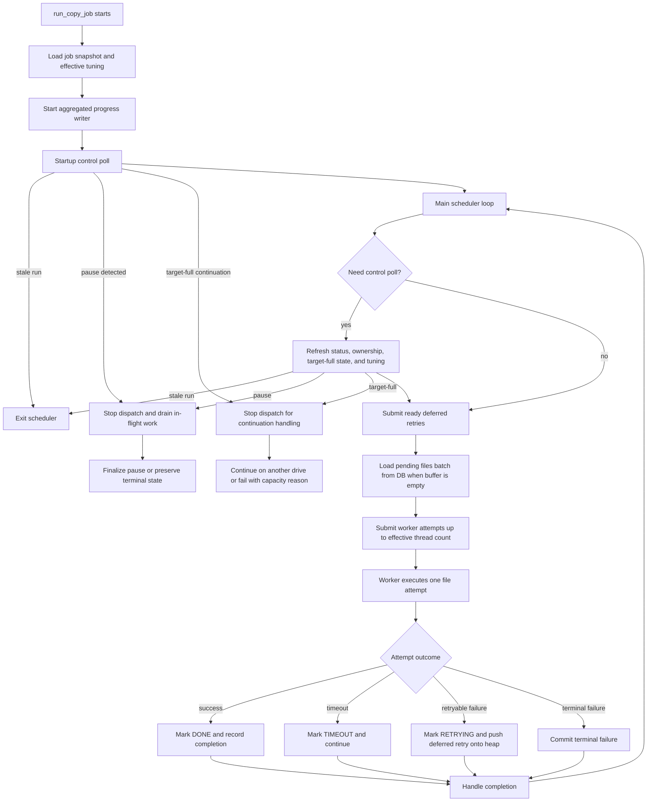

# 20. Copy Engine Implementation

| Field | Value |
|---|---|
| Title | Copy Engine Implementation |
| Purpose | Describes the current production copy-engine algorithm, control loop, worker lifecycle, progress batching, and recovery behavior implemented in ECUBE. |
| Updated on | 05/28/26 |
| Audience | Engineers, implementers, maintainers, performance reviewers, and technical debuggers. |

## 20.1 Scope

This document describes the current implementation in [app/services/copy_engine.py](../../app/services/copy_engine.py). It explains the active control flow, runtime tuning pickup, retry scheduling, progress batching, and recovery semantics used by the production copy path.

This document is intentionally different from [19-copy-engine-redesign.md](19-copy-engine-redesign.md). The redesign document captures a proposal space for future staged or strategy-based engines. This document captures the current behavior that the code executes today.

## 20.2 Implementation Summary

- The copy engine uses a per-file worker model driven by a rolling scheduler.
- Each worker invocation processes at most one file attempt.
- The scheduler refills worker capacity after completions rather than dispatching only in fixed batches.
- Failed retryable files do not sleep inside worker threads. They are returned to the scheduler as deferred retries and become eligible again after a delay window.
- Copied-byte progress updates are batched through a dedicated progress writer so the engine does not commit a database transaction for every progress callback.
- Runtime tuning changes are picked up during scheduler control polls before refill, so active file I/O is not interrupted.

## 20.3 Main Components

### 20.3.1 Job Runner

`run_copy_job(job_id)` owns the scheduler loop for a single active job run.

Responsibilities:

- resolve the source path, target path, and current job snapshot
- resolve effective runtime tuning values such as thread count, chunk size, progress flush threshold, and per-file `fsync`
- start the aggregated progress writer
- maintain the pending-file buffer, deferred-retry heap, and active future set
- poll runtime state for pause, stale-run detection, target-full continuation, and tuning changes
- handle job finalization, pause, continuation, and failure transitions after worker activity drains

### 20.3.2 Per-File Worker Attempt

`_process_file(...)` performs at most one attempt for one file.

Responsibilities:

- open an isolated SQLAlchemy session for the worker thread
- validate that the job run is still eligible to process work
- mark the file `COPYING`
- copy the file or checksum-only stream using the current per-attempt tuning values
- report copied-byte deltas through the progress writer
- commit terminal file state or return deferred-retry metadata to the scheduler

### 20.3.3 Aggregated Progress Writer

`_CopyProgressWriter` serializes copied-byte and completed-file counter updates through a single database session.

Responsibilities:

- receive byte deltas and completion counts from workers
- aggregate those updates in memory
- flush them through `FileRepository.apply_copy_progress_batch(...)`
- keep job-level and assignment-level progress counters synchronized without per-chunk transactions

This writer batches database progress accounting only. It is not a file-data pipeline.

## 20.4 Scheduler Data Structures

The scheduler loop maintains these working sets:

- `pending_buffer`: a local list of `PENDING` files fetched from the database in ascending file-id order
- `pending_cursor`: the last file id loaded into the buffer so the next fetch can continue from that point
- `deferred_retries`: a min-heap of `(eligible_at_monotonic, file_id, relative_path, attempt)` entries
- `futures`: a map of active worker futures to file ids
- control-state counters for bounded polling cadence, completion intervals, and refill latency observation

## 20.5 Execution Flow

### 20.5.1 Startup

At the beginning of `run_copy_job` the engine:

1. Loads the current job snapshot and validates the source and active assignment context.
2. Resolves effective runtime tuning from job overrides and configuration defaults.
3. Starts `_CopyProgressWriter`.
4. Performs a startup control poll before dispatching new work.

The startup control poll can immediately terminate the run if:

- a newer resume already owns the job run
- the job is already `PAUSING` or `PAUSED`
- target-full continuation should take control before more work is dispatched

### 20.5.2 Refill Loop

The scheduler loop refills capacity while `len(futures) < max_workers`.

Refill order:

1. Submit deferred retries whose delay window has elapsed.
2. Load additional pending files from the database when the local buffer is empty.
3. Submit buffered pending files until the current effective worker limit is reached.

This produces a rolling refill model where work is added as soon as completions free capacity, subject to control-state checks.

### 20.5.3 Control Poll Cadence

The scheduler polls runtime control state:

- once at startup
- when worker completions reach the configured completion-budget threshold
- when enough wall-clock time has elapsed since the previous poll
- immediately after a worker exception

Each control poll refreshes:

- latest job status
- latest `started_at` ownership marker for stale-run detection
- target-full continuation eligibility
- effective runtime tuning values and their sources

If the tuning values changed, the scheduler applies them to future submissions only. In-flight worker attempts continue with the values they were launched with.

### 20.5.4 Scheduler Flow Diagram

## 20.6 Per-File Attempt Lifecycle

### 20.6.1 Copy Path

For a normal copy attempt, `_process_file(...)`:

1. opens a dedicated worker session
2. reloads the file and job state
3. exits early if the job is paused or pausing
4. marks the file `COPYING`
5. copies data from source to destination in chunks using `copy_file(...)`
6. optionally uses `_copy_file_with_separate_hashing(...)` when separate hashing is enabled
7. reports byte progress through the progress callback
8. commits a terminal file outcome or returns a deferred retry

### 20.6.2 Chunked I/O and Hashing

The current copy path is still per-file.

- `copy_file(...)` reads from the source in `copy_chunk_size_bytes` chunks, writes the same chunk to the destination, and updates the checksum in the same loop.
- `_copy_file_with_separate_hashing(...)` keeps the file copy on the worker thread and moves checksum updates onto a dedicated per-file hashing thread backed by a bounded queue.
- Optional per-file `fsync` runs after the file body has been fully written.

The current implementation does not use a cross-file reader or writer pipeline.

### 20.6.3 Progress Reporting

Per-file progress callbacks report byte deltas, not direct database writes.

- Workers accumulate chunk progress until the flush threshold is reached.
- `_CopyProgressWriter` aggregates those deltas and flushes them in batches.
- When an attempt fails after reporting progress, the worker rolls back the previously reported byte count for that attempt before committing the failure state.

### 20.6.4 Attempt Outcomes

Possible outcomes for a worker attempt:

- success: mark `DONE`, persist checksum, and record completion counts
- timeout: mark `TIMEOUT`, audit the timeout, and do not auto-retry
- retryable failure: classify the failure, mark `RETRYING`, and return a `_DeferredRetry` record to the scheduler
- terminal failure: classify the failure, mark the file terminal, and return no deferred retry

## 20.7 Deferred Retry Model

The current implementation does not sleep inside worker threads for retry backoff.

When an attempt fails and retries remain:

1. `_process_file(...)` marks the file `RETRYING` and persists the retry audit event.
2. The worker returns `_DeferredRetry(file_id, relative_path, attempt, eligible_at_monotonic)`.
3. The scheduler pushes that record onto the `deferred_retries` heap.
4. The scheduler re-submits the file only after the delay deadline has elapsed and worker capacity is available.

This keeps worker capacity available for healthy pending files during retry-delay windows.

## 20.8 Control-State Semantics

### 20.8.1 Pause

The scheduler checks for `PAUSING` or `PAUSED` before refill after completions.

- Once pause is detected, the scheduler stops dispatching new work.
- In-flight workers finish their current file attempt.
- The job transitions to `PAUSED` or preserves a terminal state through the surrounding reconciliation and finalization paths.

This bounded check prevents a pause request from dispatching additional queued files after the scheduler regains control.

### 20.8.2 Stale-Run Detection

Each active run captures a normalized `started_at` key.

- If a later control poll observes a different `started_at` for the same job, the active scheduler treats itself as stale.
- The stale scheduler stops dispatching work and exits so the newer resume remains authoritative.

### 20.8.3 Target-Full Continuation

The scheduler checks whether the job has entered a target-full continuation state.

- When continuation should take over, the scheduler stops dispatching additional work.
- The surrounding job-finalization logic decides whether to activate the next eligible overflow assignment or fail the job with the sanitized destination-capacity reason.

## 20.9 Database Progress Batching

`_CopyProgressWriter` is the current progress batching mechanism.

- It batches `copied_bytes` deltas for the parent job.
- It batches `copied_bytes` deltas for the active drive assignment.
- It batches assignment file-count increments for successful copies.
- On SQLite-backed paths, it falls back to synchronous flushing without a background thread.

The progress writer improves transaction efficiency and keeps progress counters synchronized, but it does not change file-copy durability semantics.

## 20.10 Observability Hooks

The implementation emits control-loop metrics defined in [18-metrics-and-observability-design.md](18-metrics-and-observability-design.md).

Relevant scheduler metrics:

- `ecube_job_copy_scheduler_control_polls_total`
- `ecube_job_copy_scheduler_control_poll_interval_seconds`
- `ecube_job_copy_scheduler_completions_per_control_poll`
- `ecube_job_copy_scheduler_refill_latency_seconds`

These metrics describe how often the scheduler regains control, how many completions occur between polls, and how quickly freed worker capacity is refilled.

## 20.11 Current Implementation Boundaries

The current implementation intentionally preserves these boundaries:

- file I/O remains per-file and per-attempt
- progress batching affects database counters, not file payload writes
- retry delay is scheduler-managed, not worker-sleep-based
- runtime tuning changes affect future submissions, not already running file attempts

## 20.12 Relationship to the Redesign Proposal

[19-copy-engine-redesign.md](19-copy-engine-redesign.md) describes possible future staged or strategy-based designs such as reader and writer stages or tar-stream behavior for small-file-heavy workloads.

Those designs are not the current production algorithm. Engineers evaluating performance or correctness issues should treat this document and the implementation in `app/services/copy_engine.py` as the authoritative description of present behavior.

## 20.13 References

- [18-metrics-and-observability-design.md](18-metrics-and-observability-design.md)
- [04-functional-design.md](04-functional-design.md)
- [../operations/04-configuration-reference.md](../operations/04-configuration-reference.md)
- [../operations/11-api-quick-reference.md](../operations/11-api-quick-reference.md)
- [../development/01-debugging-guide.md](../development/01-debugging-guide.md)