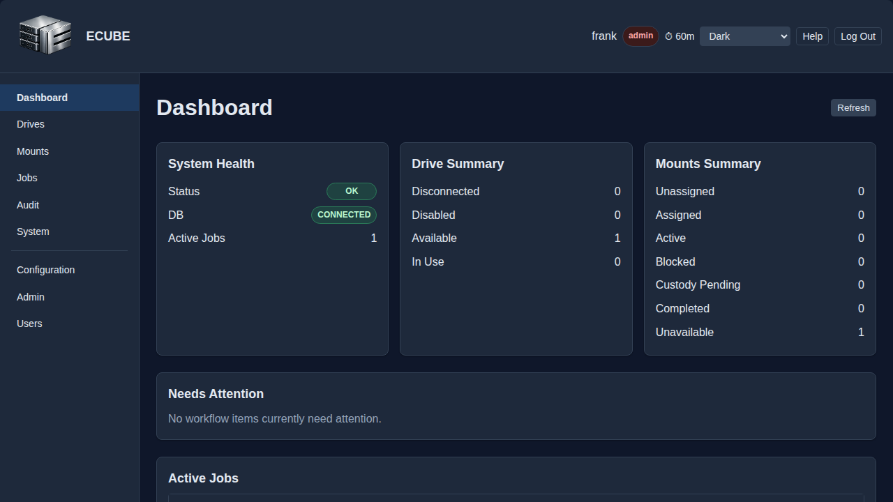

# ECUBE User Manual

| Field | Value |
|---|---|
| Title | ECUBE User Manual |
| Purpose | Guides end users, processors, managers, and auditors through day-to-day ECUBE workflows and operational tasks. |
| Updated on | 05/12/26 |
| Audience | Processors, managers, auditors, administrators, end users. |

## Table of Contents

1. [Purpose](#purpose)
2. [Scope](#scope)
3. [Installation Options](#1-installation-options)
4. [Before You Begin](#2-before-you-begin)
5. [Roles and Access](#3-roles-and-access)
6. [First Access](#4-first-access)
7. [Interface Overview](#5-interface-overview)
8. [Dashboard](#6-dashboard)
9. [Drives](#7-drives)
   - [Drive States](#71-drive-states)
   - [Formatting a Drive](#74-formatting-a-drive)
   - [Initializing a Drive](#75-initializing-a-drive)
   - [Prepare Eject](#76-prepare-eject)
10. [Shares](#8-shares)
11. [Jobs](#9-jobs)
   - [Job Detail, Verification, and File Review](#94-job-detail-verification-and-file-review)
12. [Audit Logs](#10-audit-logs)
   - [Chain of Custody Workflow](#101-chain-of-custody-workflow)
13. [System](#11-system)
   - [Application Logs Tab](#111-application-logs-tab)
   - [Manual Mount Reconciliation](#112-manual-mount-reconciliation)
14. [Users](#12-users)
15. [Configuration](#13-configuration)
16. [Webhook Callbacks](#14-webhook-callbacks)
17. [Common Tasks](#15-common-tasks)
18. [Troubleshooting](#16-troubleshooting)

---

## Purpose

This manual explains how to use the ECUBE web interface for day-to-day work. It focuses on tasks performed in the browser after the platform has already been deployed and made available by an administrator.

Primary workflows covered in this guide:

- Accessing the ECUBE web interface
- Understanding role-based navigation
- Viewing system status and drive state
- Creating and monitoring export jobs
- Reviewing job results, hashes, and file comparisons
- Managing mount definitions
- Viewing and exporting audit logs
- Accessing user and system pages when your role permits it
- Managing operational runtime configuration settings when your role permits it

## Scope

This guide is intended for users who interact with ECUBE through the web UI. It does not cover operating-system setup, service management, certificate provisioning, Docker administration, or backend troubleshooting.

For those topics, use the companion guides:

- [01-installation.md](01-installation.md) for packaged installation options
- [02-manual-installation.md](02-manual-installation.md) for native/manual deployment
- [03-docker-deployment.md](03-docker-deployment.md) for Docker Compose deployment
- [09-administration-automation-guide.md](09-administration-automation-guide.md) for administrative and API-driven tasks
- [11-api-quick-reference.md](11-api-quick-reference.md) for direct API usage

---

## 1. Installation Options

Most end users do not install ECUBE themselves, but it is still useful to understand how your environment may be delivered because the access URL, login expectations, and available integrations can vary slightly by deployment.

ECUBE is commonly provided in one of three ways:

### 1.1 Packaged Installation

An administrator installs ECUBE directly on a Linux host using the provided installer. This is the standard native or VM deployment for production-style environments.

What users should expect:

- A stable ECUBE URL provided by IT or the platform owner
- HTTPS access through the normal browser interface
- The backend API usually hidden behind the same web origin as the UI

### 1.2 Manual Installation

An administrator deploys ECUBE manually as a systemd-managed service. This is used when the installer cannot be used or when tighter enterprise controls are required. An optional external reverse proxy can be placed in front of ECUBE for additional TLS termination or load balancing.

What users should expect:

- The same browser experience as packaged installation
- Possible organization-specific hostnames, certificates, and login flow
- Split-host environments where frontend and backend are managed separately by IT

### 1.3 Docker Deployment

An administrator deploys ECUBE with Docker Compose. This is commonly used for testing, evaluation, and controlled containerized environments.

What users should expect:

- A browser URL such as `https://hostname:8443`
- The API typically reachable through the UI at `/api`
- The same UI workflows as other deployment methods

### 1.4 What Changes for the User

Regardless of installation method, the user-facing workflow is intended to remain the same:

- Open the ECUBE URL in a supported browser
- Authenticate with the account provided to you
- Use the navigation items allowed by your role
- Perform drive, share, job, and audit tasks through the UI

The main differences between installations are usually:

- Hostname and port
- Certificate trust behavior
- Whether SSO, LDAP, or local login is used
- Whether the system has already been initialized by an administrator

---

## 2. Before You Begin

Before using ECUBE, make sure you have:

- A supported browser
- The correct ECUBE URL
- A valid user account and password or SSO-backed identity
- Permission for the tasks you need to perform

Supported browser targets for the current frontend:

- Google Chrome
- Microsoft Edge
- Safari

Use one of the latest two major browser versions maintained by your organization. Firefox is not currently a supported target for the frontend.

If you do not know your role, ask your ECUBE administrator. ECUBE uses role-based access control, so some pages and buttons are visible only to certain users.

---

## 3. Roles and Access

The UI adapts to the roles assigned to your account.

| Role | Typical Access |
| ---- | -------------- |
| `admin` | Full access to all UI areas, including user administration |
| `manager` | Drive, share, and job oversight |
| `processor` | Create and manage export jobs, view system state |
| `auditor` | Read-only access to audit, job verification, and evidence review areas |

Common role effects in the UI:

- The `Audit` page is visible only to roles allowed to inspect audit records.
- The `Users` page is visible only to roles allowed to manage users.
- The `Configuration` page is visible to `admin` and `manager` users.
- The `Admin` page is visible only to `admin` users.
- Action buttons such as formatting or initializing drives may be disabled if your role does not permit them.


---

## 4. First Access

### 4.1 First-Run Setup Screen

> **Access Summary**
> **Page visibility:** Unauthenticated users are redirected here only when the ECUBE system has not yet been initialized.
> **Intended operator:** Administrator or installer owner responsible for first-run setup.

If the system has not yet been initialized, ECUBE opens the setup wizard instead of the login page. This is typically completed by an administrator. If the backend later reports during normal UI use that the database is still not configured, ECUBE returns the browser to `/setup` instead of leaving the operator on a generic server-error dead end.

The setup wizard walks through:

1. Testing database connectivity
2. Provisioning the application database
3. Choosing reverse-proxy client IP behavior (`TRUST_PROXY_HEADERS`)
4. Creating the first administrative account by entering the password twice for confirmation
5. Completing setup and returning to login

For direct/native deployments, leave reverse-proxy header trust disabled. Enable it only when ECUBE is behind a trusted reverse proxy that sets `X-Forwarded-For` or `X-Real-IP`.

Important first-run behavior:

- If the admin username entered in setup does not yet exist on the host, ECUBE creates that OS user, adds it to `ecube-admins`, and grants the ECUBE `admin` role.
- If the admin username already exists on the host, ECUBE treats that as a reconciliation path instead of an error. The wizard adds the existing OS user to `ecube-admins`, syncs the ECUBE `admin` role, resets the password entered in the wizard, and then completes setup successfully.
- In the existing-user path, the setup screen shows an informational success message indicating that the existing OS admin user was reconciled.
- After either path completes, return to the login page and sign in with the username and password you entered and confirmed during setup.

If you are not responsible for installation, stop here and contact the administrator who owns the deployment.


### 4.2 Login

> **Access Summary**
> **Page visibility:** Available to unauthenticated users after setup is complete.
> **Restricted actions:** None.

After setup is complete, open the ECUBE URL and sign in with your assigned username and password.

The login page includes:

- Username field
- Password field
- Login button
- Session-expired banner when you were redirected after token expiry
- Error banner for invalid credentials or connectivity failures

In demo deployments, the login page shows the demo message and configured account descriptions. When a shared demo password is configured, the form can prefill it for sign-in without rendering the raw password value in visible content. It does not expose per-account passwords or internal bootstrap metadata.

If your local account password has expired, ECUBE opens a required password-change dialog instead of leaving you on a generic login failure. Re-enter your current password, enter and confirm a new password, and submit the change to continue into the application. If the host rejects the new password, ECUBE keeps the dialog open and shows the policy failure message so you can correct it without restarting the login flow.

If login fails:

- Re-enter username and password carefully
- Confirm you are using the correct ECUBE URL
- Check whether your browser can reach the site over HTTPS
- Contact an administrator if your account may be locked, missing, or incorrectly assigned


---

## 5. Interface Overview

> **Access Summary**
> **Page visibility:** Available to authenticated users.
> **Restricted actions:** Navigation items shown in the shell depend on the roles assigned to your account.

After login, ECUBE displays a standard application shell:

- Header at the top
- Sidebar navigation on the left on wider screens
- Main content area in the center
- Footer at the bottom

On narrower screens, the sidebar collapses behind a header navigation toggle. Use the menu button in the header to open navigation, then tap outside the sidebar or choose a destination link to close it again.

Common navigation items include:

- `Dashboard`
- `Drives`
- `Shares`
- `Jobs`
- `Audit` (role-restricted)
- `System`
- `Users` (admin-only or otherwise restricted)
- `Configuration` (admin-only)

If you do not see a page described in this manual, your role may not include access to it.


### 5.1 Theme Selection (Light/Dark/Custom)

> **Access Summary**
> **Page visibility:** Available to authenticated users.
> **Restricted actions:** None. Theme selection is user-level and does not require an elevated role.

To change your theme in the current session:

1. Open the theme selector in the top-right header area.
2. Choose the desired theme (for example `Light` or `Dark`).
3. Confirm visual changes are applied immediately.

How theme preference is stored:

- Theme choice is saved in browser local storage for that browser profile.
- Different browsers or machines may show different themes for the same user account.

Important default-theme note:

- The web UI currently does not provide an administrator control to set a system-wide default theme for all users.
- Platform administrators can still influence the deployment default by controlling which CSS is served as `default.css` in the mounted themes directory.

For deployment-side theme and branding management, see [14-theme-and-branding-guide.md](14-theme-and-branding-guide.md) and [04-configuration-reference.md](04-configuration-reference.md) (`ECUBE_THEMES_DIR`).

Example dark-theme appearance:



---

## 6. Dashboard

> **Access Summary**
> **Page visibility:** `admin`, `manager`, `processor`, `auditor`
> **Restricted actions:** Auditor users see a reduced dashboard summary focused on system health and database status.

The dashboard provides a quick operational summary.

The page refreshes system health, drive state, mount workflow counts, the `Needs Attention` section, and the active-jobs table automatically about every 10 seconds. The `Refresh` button requests the same full dashboard snapshot on demand.

The `Drive Summary` and `Shares Summary` entries act as drill-down controls. Selecting a summary entry opens the matching destination page with the corresponding drive state or share workflow bucket preselected so the follow-up page stays aligned with the dashboard context.

Typical information shown:

- Overall system health
- Database status
- Number of active jobs
- `Needs Attention` table for blocked work, waiting-to-start assignments, and completed jobs that still require chain-of-custody closeout
- Drive state summary (`DISCONNECTED`, `DISABLED`, `AVAILABLE`, `IN_USE`)
- Mount workflow summary (`Unassigned`, `Assigned`, `Active`, `Blocked`, `Custody Pending`, `Completed`, `Unavailable`), where `Assigned` means a job exists but has not started, `Active` includes preparing, running, pausing, and verifying work, `Blocked` captures paused or failed work, `Custody Pending` captures completed or archived jobs whose handoff is still pending, and `Unavailable` marks shares whose trusted related-job or custody state could not be derived
- Table of active jobs with derived `Next Step` guidance plus trusted source, destination, and live-copy context on wider screens with compact status and progress treatment on smaller screens

The `Needs Attention` section highlights trusted workflow items that require follow-up from processors or managers. `Blocked` covers failed or paused jobs, `Waiting to Start` highlights pending assignments, and `Waiting on Custody Closeout` highlights completed or archived jobs whose trusted custody state is still `Pending handoff`. The `Needs Attention` and active-jobs tables both include a read-only `Next Step` column derived from trusted lifecycle, startup-analysis, failed-file, and custody state so operators can triage work before opening Job Detail. Each row uses the `Job ID` value as the direct navigation path into Job Detail. On wider screens, the `Project` column also carries trusted source-share, source-path, destination-drive, and follow-up context when those fields are available. On smaller screens, the dashboard stacks the summary cards vertically, hides the `Project` column in the `Needs Attention` and active-jobs tables to avoid horizontal overflow, replaces full status badges with compact labeled icons, and reduces active-job progress to the percentage label while preserving `Next Step` guidance. The dashboard source-share label follows the same role boundary as Share Detail: `admin` and `manager` users see the raw mount path, while lower-privilege operational roles see a redacted value.

Auditor users see the dashboard with only the system-health summary card; drive summary, Shares summary, needs-attention items, and active-job counts/tables are hidden.

If your password is nearing expiration, the dashboard shows a dismissible warning banner with the remaining days. Dismissing the banner hides it only for the current browser session.

Use the dashboard when you need a quick answer to questions such as:

- Is the system healthy?
- Are any jobs currently preparing, running, or verifying?
- Which jobs are blocked, waiting to start, or still waiting on custody closeout?
- How many drives are ready for use?
- How many source shares are unassigned, assigned but not started, actively processing, blocked, waiting on custody closeout, fully complete including custody handoff, or currently unavailable for trusted workflow classification?

The dashboard is intended for situational awareness, not full task execution. Use the dedicated pages for detailed operations.


---

## 7. Drives

> **Access Summary**
> **Page visibility:** `admin`, `manager`, `processor`, `auditor`
> **Restricted actions:** Drive detail actions such as format, initialize, throughput testing, and prepare eject are currently enabled only for `admin` and `manager`.

The `Drives` page shows detected USB drives and their current state.

Typical drive fields include:

- Drive ID
- Device (port-based identifier such as `2-1`)
- Project when the drive has a related job association
- Related job ID when the drive is currently tied to a job
- Current state

Available actions depend on your role and the selected drive.

### 7.1 Drive States

Every drive moves through a defined set of states. Actions available in the UI depend on the current state.

| State | Meaning | Actions available |
|-----------|-------------------------------------------------------------------------|-----------------------------------|
| `DISCONNECTED` | Drive is known to the system but is not currently physically present. | None from Drive Detail until the hardware reappears |
| `DISABLED` | Drive is physically present but attached to a disabled port, so it is not yet available for ECUBE operations. | Enable Drive |
| `AVAILABLE` | Drive is present on an enabled port and ready to be formatted or assigned to a project. | Format, Initialize, Prepare Eject when mounted |
| `IN_USE` | Drive is assigned to a project. Jobs can target this drive. | Prepare Eject |

State transitions follow this order:

```
DISCONNECTED → DISABLED → AVAILABLE → IN_USE → AVAILABLE
   ↑                                     ↑____________|
   |                                  (re-insert same project)
     (re-detect on disabled port)
```

A drive assigned to one project cannot be re-assigned to a different project without first being formatted. Formatting wipes the drive and clears the project binding.

The drive-state filter includes `DISCONNECTED`, `DISABLED`, `AVAILABLE`, and `IN_USE`. Selecting `DISCONNECTED` keeps the list aligned with dashboard drill-down navigation and automatically includes historically known but currently absent hardware. Use `Show Disconnected drives` when you want disconnected rows included while viewing a broader state filter.

After a service restart, ECUBE may automatically restore a previously mounted managed USB drive to its expected ECUBE mount slot. If a drive or mount appears to have changed state during startup, review the `Audit Logs` page for reconciliation events recorded by the system.

### 7.2 Viewing Drives

Use the page controls to:

- Refresh the current drive list
- Trigger a rescan of connected drives
- Search by device or project information
- Filter by drive state
- Sort results

When ECUBE can correlate a drive to a related job, the `Job ID` value on the Drives page acts as a direct link into that job's detail view. Drives without a related job keep the current placeholder behavior instead of showing a stale or guessed job ID.

The `Drive ID` value on the Drives page also acts as the direct navigation entry point into Drive Detail. When a drive has an active managed mount and is in the `AVAILABLE` or `IN_USE` state, the visible `Device` identifier acts as the browse entry point into that mounted content instead of a separate `Browse` row action. The browse panel title uses that same visible drive identifier, and the directory browser starts at the USB root without exposing the host mount path in the breadcrumb.

### 7.3 Drive Detail Page

Selecting a drive opens a detail view showing:

- The drive ID, the port-based `Device` value, trusted USB identity details such as serial number, manufacturer, vendor ID, product ID, negotiated speed when available, filesystem type, total capacity, last known available space, and current status
- The latest measured write speed and last throughput-test time when a prior throughput test has completed for that mounted drive
- Current project binding, plus related evidence number, job ID, and `Custody Status` only when the drive has an explicit primary or overflow assignment for that job
- Current status badge
- Available actions such as format, initialize, throughput testing, and prepare eject

If ECUBE does not yet have a current mounted-drive free-space reading for that drive, the available-space field shows `-` instead of blocking the page.

If a related job exists through an explicit drive assignment, the `Job ID` value on Drive Detail uses the same direct Job Detail navigation pattern as the clickable job context on the Drives page. A drive that is only project-bound keeps the project value but shows `-` for `Evidence` and `Job ID`, with `Custody Status` set to `No related job` until it is explicitly assigned. `Custody Status` is sourced from trusted backend chain-of-custody data for that drive's related job lifecycle and can show `Handoff recorded`, `Pending handoff`, `Status unavailable`, or `No related job`. When a recorded handoff timestamp is available, Drive Detail shows it as secondary read-only detail. This field is informational only; use `Chain of Custody` from Job Detail to review the full report or record handoff.

When the drive is mounted and in a managed state, `admin` and `manager` users can run `Test Throughput` from Drive Detail. The action measures write throughput against the mounted destination, stores the latest result on the drive record, and refreshes the `Latest Write Speed` plus `Last Throughput Test` fields on the page. `processor` and `auditor` users can still review those stored values when present, but they do not see the action button.

When `admin` or `manager` submits a drive format from Drive Detail, the confirmation dialog closes promptly after the request is accepted. Drive Detail shows a formatting-in-progress banner, disables drive actions that would conflict with the active format, and refreshes automatically until the format either completes or reports a sanitized failure on the same page. If ECUBE restarts before the background format task finishes, startup reconciliation converts the stale in-progress state into a retryable failed format result so the drive does not remain stuck in `PENDING`.

When you open browse from Drive Detail, the panel title also uses the visible device identifier and the breadcrumb stays root-relative instead of showing the host mount path.

Reference screen:


### 7.4 Formatting a Drive

If your role allows it, you can format a drive from the detail page.

Current UI options include:

- `ext4`
- `exfat`

Formatting removes all existing data and clears the project binding. After formatting, the drive can be initialized for any project that has an eligible mounted share.

The Format action is unavailable while the drive is mounted. If the drive is currently mounted, use the appropriate unmount or prepare-eject workflow first.

Confirm the target drive carefully before proceeding.

### 7.5 Initializing a Drive

Initialization assigns a drive to a project identifier and transitions it to `IN_USE`. Once initialized, project isolation rules apply to all writes performed through ECUBE.

Initialization  requires at least one network share that is both assigned to the same project and currently in the `MOUNTED` state. If no eligible mounted share exists, the UI disables submission and the API rejects the request.

When you open the Initialize dialog:

- The **Project** field is shown as a dropdown populated from distinct project IDs on mounted shares only.
- The dialog also shows the mounted destination context for the selected USB drive while still redacting the raw internal path from standard operator views.
- If the drive has a previous project assignment and that project still has an eligible mounted share, that project is pre-selected.
- If no eligible mounted project exists, the dialog shows a helper message telling you to add and mount a share first.
- Canceling the dialog does not change the drive state, project binding, or action availability.

Before initializing a drive:

- Confirm the correct source share for the case or matter has already been added and mounted.
- Select the correct project from the dropdown list.
- Confirm the drive is the intended destination media.
- If you need to assign the drive to a *different* project, format it first to clear the existing binding.

### 7.6 Prepare Eject

Use `Prepare Eject` before physically removing a mounted drive. The action is available for `IN_USE` drives and for `AVAILABLE` drives that still have an active mount. ECUBE flushes pending writes, unmounts the filesystem, and transitions the drive to `AVAILABLE`.

If the drive still has an unreleased `COMPLETED` or `FAILED` job assignment and that job has callback delivery configured, a successful prepare-eject sends a `DRIVE_EJECT_PREPARED` callback for that job and stores the audit row with the attached job context.

After a successful prepare-eject:

- The drive state returns to `AVAILABLE`.
- The project binding is preserved so the drive can be re-initialized for the same project without reformatting.
- The drive **cannot** be initialized for a *different* project until it has been formatted.
- The drive can be physically removed once the operation completes.

If ECUBE reports that the drive is still busy, the confirmation dialog closes cleanly and the page shows a specific retry message. Close any open shell, file browser, or process still using the mounted drive, then retry `Prepare Eject`.

If the drive is already `AVAILABLE` but still mounted, a failed prepare-eject leaves it in `AVAILABLE` so the operator can retry after resolving the blocking condition.

If the drive is still assigned to a job that has started and is not yet completed, `Prepare Eject` is blocked. This includes jobs in `PREPARING`, `RUNNING`, `PAUSING`, `PAUSED`, or `VERIFYING`. Complete or otherwise finish the active job before retrying `Prepare Eject`.

If ECUBE detects timed-out or failed files in active drive assignments, the first `Prepare Eject` attempt is blocked with an explicit confirmation-required warning. Review the warning details, then confirm a second prompt to continue with ejection.

> Use `Chain of Custody` from `Job Detail` to record legal handoff details for the job's assigned drive. The handoff is stored in ECUBE's audit and CoC records without adding a separate archived drive state.

---

## 8. Shares

> **Access Summary**
> **Page visibility:** `admin`, `manager`, `processor`, `auditor`
> **Restricted actions:** `admin` and `manager` can add shares. Mounted-share browsing from the list and from Share Detail is available to `admin`, `manager`, and `processor`, but not `auditor`.

The `Shares` page manages source locations used for export jobs.

You can typically:

- Refresh the share list
- Open Share Detail for an existing share definition from the clickable share ID
- Filter the list by workflow bucket (`Unassigned`, `Assigned`, `Active`, `Blocked`, `Custody Pending`, `Completed`, or `Unavailable`) or search by share details

`admin` and `manager` users can also add a new share definition and edit or remove a share from Share Detail. `processor` users can browse mounted shares from the clickable project value on the Shares page and from Share Detail. `auditor` users can open the Shares page and Share Detail, but they do not see browse, `Test Throughput`, `Edit`, or `Remove` actions and sensitive path fields remain redacted.

When you arrive from a Dashboard `Shares Summary` entry, the matching workflow bucket is preselected so the destination list stays aligned with the dashboard context.

### 8.1 Adding a Share

The add-share dialog supports common fields such as:

- Type (`SMB` or `NFS`)
- Project ID
- Remote path
- Username
- Password
- Credentials file

When adding a new share, `admin` and `manager` users can use `Browse` inside the dialog to discover available SMB shares or NFS exports from the entered target server. The browse dialog reuses any credentials entered in the form, shows discovered shares in a scrollable picker when the result set is long, and selecting a result fills the `Remote path` field automatically.

Project assignment is required when creating a share. Drives can only be initialized for projects that have at least one assigned share in the `MOUNTED` state.

ECUBE rejects exact duplicate remote paths and blocks overlapping parent or child remote paths across different projects. Nested paths for the same project remain allowed. If two operators submit changes at the same time, one request may briefly return a conflict while ECUBE finishes the in-progress update.

For security, the standard mount list and browse labels intentionally redact raw remote paths and local mount points in operator-facing views.

ECUBE creates the local mount point automatically based on the remote path. Generated ECUBE-managed SMB and NFS mounts are created under `/mnt/ecube-network/*`.

After a service restart, ECUBE may automatically restore an expected managed share mount or remove a stale ECUBE-managed mount point that no longer matches persisted system state. These startup corrections are intentional and are recorded in the audit log with sanitized details.

The exact credential fields required depend on the mount type and your environment.

If share browsing is unavailable because the ECUBE host is missing a required discovery tool, the dialog  shows an actionable message telling the operator which host package to install before retrying. Demo mode does not hide the browse control or block share discovery.

### 8.1.1 Editing a Share

Use the clickable share ID on an existing share row to open Share Detail, then use `Edit` from the detail action row to reopen the edit dialog in place.

- The dialog pre-fills the current type, remote path, and project ID.
- Share Detail shows Type, Project, NFS Client version, Last Checked, Latest Read Speed, Last Throughput Test, Job ID, Job Status, and share Status before you open the dialog. `Job Status` is sourced from trusted backend job data when a related job exists, falls back to `No related job` when the project has no current related job, and falls back to `Status unavailable` instead of guessing when authoritative job status cannot be determined. The dashboard share workflow summary separately considers trusted related-job custody status, so preparing, running, pausing, or verifying jobs appear under `Active`, paused or failed jobs appear under `Blocked`, completed or archived jobs with pending handoff appear under `Custody Pending`, and `Unavailable` remains the fallback when trusted related-job or custody classification cannot be derived for that share. `admin` and `manager` users also see the raw Remote Path and Local Mount Point values there; read-only roles see those path fields redacted.
- The local mount point is shown as read-only informational context and is not directly editable.
- Stored credentials are not returned to the UI. Leaving the credential fields blank preserves the stored values.
- Use `Clear saved credentials` if you need to remove previously stored SMB credentials without replacing them in the same edit.

When you save, ECUBE updates the existing share record instead of creating a new one. If the share is currently mounted, ECUBE attempts to remount it immediately with the edited options, including any explicit NFS client-version override. If the backend rejects the change, or if the returned share status is `ERROR`, the dialog stays open so you can review the returned error state before closing it.

When the selected share is `MOUNTED`, `admin` and `manager` users can run `Test Throughput` from Share Detail. The action measures read throughput from the mounted share, stores the latest result on the share record, and refreshes the `Latest Read Speed` plus `Last Throughput Test` fields on the detail page. This action is separate from the `Test` button inside the Add/Edit dialogs, which continues to validate connectivity for the configuration being edited.

### 8.2 Testing Share Connectivity

Use `Test` inside the `Add Share` dialog before creating a new share, or inside the `Edit Share` dialog before saving changes to an existing share.

The dialog must show a successful test result before `Create` or `Save` becomes available. This keeps share validation tied to the exact configuration you are about to persist rather than to a separate list-level action.

When a successful validation also returns operator guidance, the dialog keeps the normal success banner and shows a separate warning banner in the same header area. For NFS shares, the warning can explain that the effective `NFS 4.1` validation path is slow on the current server and that `NFS 3` validated much faster during the same test workflow, including when the dialog is left on `Use default (4.1)`.

### 8.3 Removing a Share

From Share Detail, `admin` and `manager` users can remove the share definition when it is no longer needed.

Remove a share only if it is no longer needed. If existing workflows depend on it, removing the definition can interrupt job creation or repeatability.


---

## 8.4 Directory Browser

The directory browser allows users to explore the contents of active mount points (USB drives and network shares) before creating an export job.

**Accessing the browser:**

- **From Drives:** Click the visible device label on the Drives page when the drive is mounted and in an active `AVAILABLE` or `IN_USE` state to open the directory browser rooted at that managed ECUBE drive mount.
- **From Drive Detail:** Click the `Browse` button on any mounted drive to open the directory browser rooted at that drive's mount point.
- **From Shares:** Click the mounted share's `Project` value to open browse directly from the list. The browse panel title uses the same project value in the form `Browse share <project> contents`.
- **Mounted share root display:** Mounted-share browsing starts at `/`. The breadcrumb must not expose the share name, local mount point, or a doubled leading slash such as `//folder`.

**Navigating:**

- Click a folder name to descend into it. The breadcrumb trail at the top shows the current path.
- Click any breadcrumb segment to navigate back up.
- Symlinks appear with a link icon and are not navigable.
- Results are paginated; use the page controls at the bottom to navigate large directories.

**Roles:** All authenticated roles (`admin`, `manager`, `processor`, `auditor`) can browse directories.

> **Note:** Only active, registered ECUBE mount points can be browsed. A pre-existing host mount outside the managed ECUBE USB mount root does not create a drive browse entry point until the drive is mounted into its managed ECUBE slot.

---

## 9. Jobs

> **Access Summary**
> **Page visibility:** `admin`, `manager`, `processor`, `auditor`
> **Restricted actions:** Creating jobs in the current UI is enabled for `admin`, `manager`, and `processor`.

The `Jobs` page is the main workspace for creating and tracking export operations.

The page includes:

- A jobs table
- Search and status filters
- Refresh action
- `Create Job` dialog

### 9.1 Viewing Jobs

Use the jobs table to review:

- Job ID
- Project ID
- Evidence number
- Device
- Current status
- Progress label or percentage

For active jobs, the progress value stays synchronized with both copied bytes and completed file counts. During startup analysis, a newly started, resumed, or retrying job can show `Preparing...` in the Jobs list while ECUBE scans the source files and calculates totals. A `PREPARING`, `RUNNING`, `PAUSING`, or `VERIFYING` job does not show 100% until the finished-file totals also indicate completion.

Common statuses include:

- `PENDING`
- `PREPARING`
- `RUNNING`
- `PAUSING`
- `PAUSED`
- `VERIFYING`
- `COMPLETED`
- `FAILED`

The `Job ID` value on the Jobs page acts as the direct navigation entry point into Job Detail. On desktop, authorized rows show one stateful lifecycle action. That action shows `Start` when the job can begin or resume, shows `Pause` when the job has entered active work, stays visible as a disabled `Pause` while the job is still entering copy work during `PREPARING`, and also stays disabled while the job is draining in-flight work during `PAUSING`. Other ineligible states keep that action hidden or disabled.

### 9.2 Creating a Job

Job creation uses a grouped dialog. The same grouped dialog shell is also reused when you edit an eligible job from Job Detail, so the overall section layout and required-field treatment stay consistent.

The dialog is organized into four sections:

1. `Job details` — project, evidence number, optional notes, webhook callback URL, and thread count
2. `Source` — the mounted project share, a trusted source path field, and a folder browser for the selected mount
3. `Destination` — the eligible mounted USB device for the selected project
4. `Execution` — the optional `Run job immediately` checkbox

Only the `Project` field is active when the dialog opens. After you select a project, ECUBE unlocks the remaining fields and filters the available shares and destination drives to project-matching, currently eligible resources. Required fields use the shared required-marker icon in their labels, and the footer repeats that marker with a `Required field` legend.

The destination selector is labeled `Select device` and shows the same port-based `Device` value used elsewhere in the UI, rather than a serial number or `#id` prefix.

ECUBE does not copy from an arbitrary share to an arbitrary USB drive. The source side and destination side must both be compatible with the same project:

- The source share must already exist in `Shares`, be assigned to the project ID, and be in the `MOUNTED` state
- The destination drive must be mounted and already bound to that same project
- In the standard operator workflow, that means the drive has already been initialized for that project before the copy starts

If an operator tries to create or edit a job with an explicit primary or overflow drive that is still unassigned, ECUBE rejects the request and tells the operator to initialize and bind the drive before selecting it.

Before creating a job, confirm:

- The correct project is selected first
- The source share and destination drive both match that project
- The evidence number and source path are correct
- If you need a job-specific webhook, enter the `Webhook callback URL` in the `Job details` section
- If you enable `Run job immediately`, the job will start as soon as creation succeeds

The Workflow tab opens with `Thread count`, `Copy Chunk Size`, `Progress Flush Threshold`, and `Force per-file disk sync` already pre-selected to the current global defaults from `Configuration` > `Copy and Job Workflow`. Those pre-selected values come from the live backend configuration at the moment the dialog opens (including `.env` values such as `COPY_DEFAULT_THREAD_COUNT`, `COPY_CHUNK_SIZE_BYTES`, `COPY_PROGRESS_FLUSH_BYTES`, and `COPY_FILE_FSYNC_ENABLED`) and serve as the starting point for the job. When you save the job, ECUBE stores the values you submit as per-job copy-tuning settings. Startup-analysis auto-apply treats values that still match the current defaults as inherited configuration rather than explicit overrides. Change `Thread count` if you want a different per-job value; choose between `1` and `32`. Copy work is I/O-bound, and the best value depends on the source data shape plus the source and destination media. A higher thread count (for example `12`) tends to help most when the source contains a large number of small files, because per-file overhead dominates and parallel workers keep the source and destination busy. For a smaller number of large files, a lower thread count is usually sufficient because each file already streams continuously. Reduce the value again if the host becomes sluggish or if copy speed does not actually improve.

The same Workflow tab includes `Auto-apply startup analysis profile` as a per-job checkbox in the Create Job dialog. When selected, ECUBE can apply the startup-analysis recommended workload profile for that job after startup analysis finishes. The auto-apply step leaves explicit per-job tuning overrides unchanged until you apply the recommendation from Job Detail.

The source path is interpreted inside the selected mounted share. Entering only / uses the root of that share, and attempts to navigate outside the selected share are rejected before the job is created. After a project is selected, the visible `Source path` field becomes read-only in the standard job dialog workflow, so use `Browse folders` in the `Source` section after selecting a mount. As you move through the mounted share, ECUBE updates the existing `Source path` field live, and the browser shows a `..` row whenever you can move back up to the parent folder.

### 9.3 Opening a Job

Open a job to view details and perform follow-up actions.

The Jobs list hides archived jobs by default. To review archived work, enable `Show Archived Jobs` to bring those records back into the list.

Archived jobs remain readable from Job Detail, but they are intentionally treated as sunset records instead of active work. Once a job is archived, the normal lifecycle actions stay visible only as disabled context or disappear where appropriate, and the archive action itself is no longer shown.


---

### 9.4 Job Detail, Verification, and File Review

> **Access Summary**
> **Page visibility:** `admin`, `manager`, `processor`, `auditor`
> **Restricted actions:** `Analyze`, `Apply Recommended Profile`, `Edit`, the lifecycle toggle (`Start` or `Pause` depending on trusted job state), `Continue on Another Drive`, `Retry Failed Files`, `Complete`, `Verify`, and `Manifest` are enabled for `admin`, `manager`, and `processor` when the current job state allows them. `Chain of Custody` becomes available to authorized roles after the job reaches `COMPLETED` and remains available on archived job detail pages for stored-report review. Within that report, `Custody Handoff` appears only for `admin` and `manager` when the loaded report still shows incomplete custody. `Archive` and `Clear startup analysis cache` remain limited to `admin` and `manager` when the current job state allows them. `Delete` is shown only for eligible pending jobs. Hash inspection and source/destination comparison remain available to `admin` and `auditor`.

The job detail page provides deeper inspection and follow-up controls.

The page is organized into three major panels before the action row. `Current Task` appears first and keeps the shared progress surface, the Dashboard-derived `Next Step` guidance, the Dashboard-aligned `Follow-up` state when one applies, and any failed-file or timed-out-file counters that explain the immediate operator task. `Job Information` appears next and groups read-only metadata into `Source Information`, `Destination Information`, and `Job details` panels. `Job Completion Summary` follows that grouped metadata so operators can review completion and manifest state before choosing the next action.

Within `Job Information`, `Source Information` shows the trusted source path together with the source `Discovered files`, `Estimated total bytes`, `Analysis status`, `Last data analyzed`, `Recommended workload profile`, and startup-analysis file-size distribution values. When source totals are not available yet, the count and size fields show `N/A` until ECUBE determines them. `Destination Information` shows the selected destination drive, last known available space, the current `Files copied` count, and any reserved or active overflow assignments associated with later media. `Job details` shows the user-entered job metadata that is not source-specific or destination-specific, including `Thread count`, the job-specific `Callback URL`, and operator notes. Source paths are shown relative to the selected mounted share so they match the browse workflow; `/` means the root of that share, and nested folders appear under that root such as `/evidence`.

Typical functions include:

- Run manual startup analysis before copy starts so the operator can review discovered files and estimated bytes
- Apply the startup-analysis recommended workload profile directly from Job Detail when the operator wants to set the per-job copy tuning to that recommendation
- Edit a pending job before copy work has started, including after startup analysis completes while the job remains pending
- Adjust the per-job copy-tuning values (thread count, copy chunk size, progress flush threshold, force per-file disk sync) and reserved overflow-drive selections after a job has started without redefining the source, project, or primary destination
- Use the lifecycle toggle to start a pending job, resume a paused one, or pause an active job; start, retry, and continuation requests first move through `PREPARING` before copy threads resume in `RUNNING`
- Continue remaining work on another mounted destination drive when the original destination fills or a partial-success run must move to new media
- Retry only the failed or timed-out files from a partial-success completed job
- Manually complete a safe non-active job when required by the workflow
- Use `Chain of Custody` as the standard sunset path when custody is being transferred
- Use `Archive` only as an exceptional administrative or non-handoff closure path after `Prepare Eject` when the related drive is still attached
- Clear a persisted startup-analysis snapshot before the next restart when the cached scan should be discarded
- Generate a manifest, review the reported location, and download the generated file
- Review copied files
- Inspect hashes for individual files
- Compare a file's source version against its copied destination version

Job Detail keeps full job duration and copy performance as separate read-only values. `Duration` covers the whole active run from `PREPARING` through copy completion, while `Copy rate` and `Time remaining` use only the active copy phase after the job has entered `RUNNING`.

#### 9.4.1 Editing, Lifecycle Actions, Retrying Failed Files, Completing, Verifying, and Generating a Manifest

Action buttons are shown after the `Job Completion Summary` panel.

Use them when appropriate:

- `Analyze` to run startup analysis for an eligible job without starting copy
- `Apply Recommended Profile` to apply the startup-analysis recommended workload profile to the job's per-job copy tuning settings
- `Edit` to reopen the grouped job dialog from Job Detail. For a `PENDING` job, the dialog supports the pre-start edit flow for the mutable copy-definition fields. For a started job, the dialog switches to a restricted runtime-tuning view that allows only the per-job copy-tuning values (`Thread count`, `Copy Chunk Size`, `Progress Flush Threshold`, `Force per-file disk sync`) and reserved overflow-drive selection changes.

When the edit dialog contains more content than fits on screen, ECUBE keeps the header and footer pinned and scrolls only the dialog body so the title, required-field legend, and save/cancel actions stay visible.
- After a job has started, ECUBE keeps the existing evidence number, project, source path, mount, primary destination drive, notes, and callback URL fixed. The restricted edit dialog leaves those fields read-only or hidden and saves only the allowed runtime-tuning values.
- For an active copy run, runtime-tuning edits are applied between dispatch batches after in-flight file work finishes, so ECUBE does not interrupt the currently copying file to apply the new values.
- The lifecycle toggle to show `Start` when a job can begin or resume, `Pause` when an active job can safely stop after its current copy work finishes, and a disabled `Pause` while the job is still entering active copy work during `PREPARING` or draining in-flight work during `PAUSING`
- `Continue on Another Drive` to choose a different mounted destination drive and continue the remaining work for an eligible `PENDING`, `PAUSED`, `FAILED`, or partial-success `COMPLETED` job
- `Retry Failed Files` to re-queue only `ERROR` and `TIMEOUT` file rows on a `COMPLETED` job that finished with partial-success results
- `Complete` to manually mark a pending, paused, or failed job as complete when the operational workflow requires it
- `Chain of Custody` to open the job-scoped chain-of-custody report as the normal closeout step once the job is completed and custody is being transferred
- `Archive` to sunset a completed or failed job after confirmation when an exceptional administrative or non-handoff closure is required; this action is limited to `admin` and `manager` and requires `Prepare Eject` first when the job still has a related drive assignment
- `Clear startup analysis cache` to remove a persisted startup scan after explicit confirmation; this is available only to `admin` and `manager` when cached startup-analysis data exists for the job
- `Verify` to run verification checks once the job is fully complete with no failed or timed-out files
- `Manifest` to generate the manifest output once the job is fully complete with no failed or timed-out files

When a pause is requested, the Jobs list and Job Detail page can show a `Pause in progress` dialog while ECUBE waits for active copy threads to drain. During `PAUSING`, the lifecycle toggle remains visible as a disabled `Pause` button and returns to `Start` once the job reaches `PAUSED`.

While a job is active, Job Detail shows a live summary with the current run `Started at` timestamp and a `Duration` field that reflects cumulative active runtime only. The displayed duration continues updating while the job is `PREPARING` or `RUNNING`, does not add paused time while the job is `PAUSED`, and resumes from the previously stored active runtime after a later restart instead of resetting to zero.

Verify and Manifest stay disabled until the job reaches a truly complete 100% state. After manifest generation, the detail page shows a success banner for the latest refreshed `manifest.json` file and immediately starts a browser download of that generated manifest without an extra confirmation step. For jobs that used overflow media, ECUBE refreshes a separate `manifest.json` on each drive that received successful copies, and each file lists only the files written to that specific drive.

For a partial-success `COMPLETED` job, Job Detail can show `Retry Failed Files` instead of exposing Verify or Manifest too early. This action is available only to `admin`, `manager`, and `processor`, moves the job back into `PREPARING`, re-queues only failed or timed-out files, preserves already successful copies, and returns to `RUNNING` after preparation completes.

When `Start` is used on a `FAILED` job, ECUBE restarts that same job and returns it to `PREPARING` before copy resumes. During preparation, file rows that are not `DONE` are re-queued for copy while rows already marked `DONE` remain preserved. This is the standard recovery path for failures caused by runtime errors and for jobs marked failed during startup reconciliation with `JOB_RECONCILED`.

If the original destination drive fills or the remaining copy work must move to new media, ECUBE first checks for the next reserved overflow drive that was preassigned to the job during creation. When that reserved drive is still mounted, still belongs to the same project, and passes the trusted backend free-space check for the remaining estimated bytes, ECUBE keeps the same job ID, activates that reserved drive assignment for chain-of-custody purposes, and automatically resumes only the remaining work on that next drive. If no assigned drive is available or can be validated for continuation, ECUBE marks the job `FAILED` with a safe destination-capacity reason. Job Detail can then show `Continue on Another Drive` so the operator can choose another mounted project-compatible drive and optionally adjust thread count. Automatic manifest generation still waits for a later clean completion, but it refreshes manifests per drive assignment instead of only on the final drive.

This is not limited to only two drives. If the second drive also fills, the same job can be continued again onto a third drive, and later onto additional drives if needed, as long as each new drive is mounted and project-compatible.

This continuation happens automatically only when another reserved overflow drive for the same job is still mounted, still project-compatible, and passes the remaining-capacity probe. If there is no eligible prepared drive, the copy run stops with a failed destination-capacity result so an operator can open `Job Detail`, review the safe failure reason, and explicitly choose `Continue on Another Drive` for the next destination.

#### 9.4.1a Overflow Continuation Workflow

Use `Continue on Another Drive` when the original destination media can no longer carry the rest of the job and ECUBE did not already continue automatically onto another eligible prepared drive.

Typical reasons include:

- The first drive filled before the source set was fully copied
- A later overflow drive also filled before the remaining work was finished
- The job reached `COMPLETED` but still shows failed or timed-out file counts caused by destination-space limits or other media-related interruption
- The copy must continue on replacement media without creating a second ECUBE job

What this action does:

- Keeps the same job ID, evidence number, audit history, and chain-of-custody lineage
- Adds a new destination-drive assignment for the same logical job
- Leaves already successful files on the earlier drive unchanged
- Re-runs only the remaining work on the newly selected drive
- Refreshes per-drive manifests after a later clean completion so each drive records only the files copied to that media
- Can be repeated again later if that newly selected drive also overflows
- Becomes the manual follow-up when no eligible automatic handoff drive is available and the job stops in `FAILED`

What to do before you start:

- Confirm the replacement drive is inserted, mounted, and project-compatible
- Confirm the source share for that project is still present and mounted
- Confirm the original drive has already been handled according to your SOP if it is full or no longer needed in the host
- Review the job summary so you understand whether the remaining work is pending, failed, or timed out
- If startup analysis is available, review the operator-safe shortfall or remaining-work guidance shown in Job Detail

Recommended workflow:

1. Open the affected job in `Job Detail`.
2. Review the summary counters, especially `Files failed`, `Files timed out`, and any destination-space shortfall message.
3. Insert and prepare the next destination drive so it appears as an eligible mounted device for the same project.
4. Click `Continue on Another Drive`.
5. In the dialog, select the new destination drive.
6. Leave `Thread count` unchanged unless you have a specific operational reason to change it.
7. Confirm the action.
8. ECUBE resumes the same job on the new drive and records the new drive assignment automatically.
9. Expand the `Files` panel if you need to confirm which files are landing on which destination drive.

Important operator notes:

- This is not the same as `Retry Failed Files`. Retry keeps the current destination assignment, while overflow continuation intentionally switches the remaining work to different media.
- `Continue on Another Drive` is intended for moving unfinished work forward. It does not merge files back onto the earlier drive.
- The `Destination drive` column in the Files panel shows where each copied file ended up after the overflow continuation.
- Verification and manifest generation still wait for a clean completed result with no failed or timed-out files.
- Automatic manifest generation still waits for clean completion, but once the job finishes ECUBE refreshes a separate `manifest.json` on each drive that received successful files for that job.
- Chain-of-custody reporting continues to follow the same job and will reflect the multiple drive assignments tied to that job.
- If a second or later overflow drive also fills, repeat the same `Continue on Another Drive` workflow on that same job.
- Reserving several overflow drives in the `Create Job` dialog allows ECUBE to continue automatically only when the next reserved drive is still mounted and large enough for the remaining estimated work.

For evidence-bearing work, treat `Chain of Custody` as the standard sunset path. Use it to review the stored report and, when needed, launch the separate `Custody Handoff` dialog to record custody transfer in ECUBE even when external paper paperwork is also being used.

`Archive` opens its own confirmation dialog and is available only for `COMPLETED` or `FAILED` jobs after the related drive has been through `Prepare Eject`. This is an exception-only path for administrative or non-handoff closure. The confirmation explicitly warns that the job cannot be restored from the UI and that archive does not itself record custody handoff. After confirmation, the job transitions to `ARCHIVED`, remains viewable in Job Detail for audit and review purposes, drops out of the default Jobs list, and no longer blocks recreation of the same exact project/source/destination work definition.

`Delete` remains limited to eligible pending jobs that have not yet become part of the operational record. It is not a substitute for closing out historical work.

The completion summary uses the normal success styling for clean completions. If the summary still shows any failed or timed-out file counts, the summary switches to a red warning background so operators can distinguish a partial-success completion from a clean completed run at a glance.

During startup analysis, Job Detail can show `Preparing copy...` before any totals are known. While this state is visible, the page also explains that ECUBE is still scanning the source files and calculating totals, which can take time for large evidence sets.

During `VERIFYING`, Job Detail keeps the same progress surface in `Current Task` but switches its text to verification-specific guidance. The page does not present an exact verification percentage because the current API does not expose verification counters.

Manual Analyze runs use the same startup-analysis engine before copy begins. Job Detail can show `Startup analysis started.` while the scan is running, then replace it with `Startup analysis completed.` when the persisted analysis summary is ready. The summary panel can show the startup-analysis state, discovered files, estimated total bytes, last analyzed time, and a sanitized failure reason when analysis fails.

If startup analysis is already `READY` and the related drive also has a last known available-space reading, ECUBE checks those values again when `Start` is pressed. If the destination cannot hold the estimated source size, copy does not begin and the page shows an operator-safe shortfall message so the operator can select another drive or use the follow-on overflow workflow.

While startup analysis is actively running, Job Detail disables conflicting lifecycle actions so operators cannot edit, start, complete, delete, or clear the startup-analysis cache until the analyze run finishes. Delete and `Clear startup analysis cache` can remain visible for eligible jobs but stay disabled until the startup-analysis state leaves `ANALYZING`. If ECUBE restarts before that analyze run finishes, startup reconciliation automatically removes the stale in-progress lockout before operators return to the page: current cached results come back as `READY`, and incomplete cached state is discarded so the job returns to a retryable `NOT_ANALYZED` state.

If the Jobs page remains open while a manual analyze run finishes, ECUBE can show a page-level completion message for that job so operators notice the result without reopening Job Detail.

If a job is restarted after a failed, paused, or partially successful run and its persisted startup-analysis snapshot is still current, ECUBE can reuse that cached scan instead of repeating the full startup analysis. ECUBE clears the reusable snapshot automatically only after a clean completion with no failed or timed-out files. When operators need to discard that snapshot, the `Clear startup analysis cache` action opens a confirmation dialog and removes only the cached startup-analysis data. It does not remove per-file history, copied-file state, or other audit-relevant job records.

When a job is paused, completed, or fails, the detail view shows a summary with the job start time, copy thread count, files copied, files failed, files timed out, total copied, elapsed time, copy rate, completion time, and manifest freshness state, plus any failure reason or related log hint. The manifest summary includes `Last manifest created` and a text status such as `Current`, `Stale`, or `No manifest available` so operators can tell whether the latest manifest post-dates the latest completed job state. A `COMPLETED` job means all files reached a terminal state, not necessarily that every file copied successfully, so the summary can still report failed or timed-out files after a partial-success completion. In this panel, `Files failed` counts file rows currently in `ERROR`, while `Files timed out` counts file rows currently in `TIMEOUT`. The elapsed time remains cumulative across earlier run segments, so a paused and later resumed job keeps the same additive runtime history that was shown while it was active. Failed jobs prefer a persisted sanitized job-level failure reason when one is available, so operators can see stable messages such as `Unexpected copy failure` or `Job interrupted by service restart before completion` before any derived per-file fallback. Completed jobs with file-level failures instead show the safe per-file failure summaries and counters without exposing raw provider errors or host paths. When `COPY_JOB_TIMEOUT` is exceeded for an individual file attempt, that timeout is recorded as a per-file error (for example `File copy timed out after 3600s`) rather than a whole-job timeout reason.

When ECUBE can safely correlate a failed copy to the selected source or destination for that job, the failure summary may add relative hints such as `source: reports/a.txt` or `destination: reports/a.txt`. Raw host or mount paths are not shown in the Job Detail summary.

#### 9.4.2 File List

The Files panel is collapsed by default on Job Detail. Use `Show files` to expand it and `Hide files` to collapse it again without losing the current page.

When expanded, the file table usually shows:

- File ID
- Relative path
- Destination drive
- Status

The destination-drive column becomes especially important after an overflow continuation, because the same job can span more than one destination drive while still preserving a single job record.

This per-file destination information is more granular than the manifest location. At clean completion, ECUBE refreshes a separate `manifest.json` on each drive assignment that received successful copies, while the table can still show exactly which earlier files were copied to an earlier overflow drive.

Rows that include a safe file-level error summary are visually emphasized in the Files panel. Select the `ERROR` or `FAILED` status badge on desktop, or the matching compact status icon on smaller screens, to open the `File Error Details` dialog for that row. The dialog shows the file ID, relative path, status, and the sanitized per-file error text returned by the trusted backend.

Users allowed to inspect hashes open the hash viewer by selecting the file path itself. On smaller screens, ECUBE may replace full status badges with compact status icons and shorten the visible pagination window so the file list stays within the viewport.

If the job contains more rows than fit on one page, the panel shows a numbered pagination control with left/right navigation. Desktop layouts expose a wider page-number window, while smaller screens show a shorter page-number window to reduce horizontal crowding. The number of rows shown per page is controlled by the admin-only `Job Detail Files Per Page` runtime setting and is bounded between 20 and 100.

#### 9.4.3 Hash Viewer

Users with sufficient permissions can inspect file hashes in a popup dialog opened from the file path in the Files panel. The dialog includes values such as:

- MD5
- SHA-256

The same popup also includes the compare workflow, so operators can inspect hashes and then compare the selected exported file against its source version without leaving Job Detail.

#### 9.4.4 Compare Source and Destination

The compare workflow uses clear `Source` and `Destination` terminology inside the hash viewer popup. After you open hashes for an exported file, choose the source file in the compare selector to evaluate the original source version against the copied destination version.

Comparison output includes:

- Overall match
- Hash match
- Size match
- Path match

This is useful when reviewing evidence consistency or confirming repeatability after copy or verification steps. If either side is unavailable, ECUBE shows a sanitized conflict message instead of exposing raw filesystem details.

Verify and Manifest stay disabled until the job reaches a truly complete 100% state. After manifest generation, the detail page shows a success banner with the location of the refreshed `manifest.json` file on the destination drive and immediately starts a browser download of the same generated manifest JSON without an extra confirmation step.


---

## 10. Audit Logs

> **Access Summary**
> **Page visibility:** `admin`, `manager`, `auditor`
> **Restricted actions:** CSV export is available from the page for authorized users.

The `Audit` page is available only to authorized roles.

Use it to:

- Refresh the current server-backed result set
- Filter by user, action, and job using dropdown filters populated from stored audit values
- Search across visible audit fields with a free-text search box
- Filter by date/time range across the full audit history
- Move through paginated result pages using numbered page shortcuts
- Expand structured details for individual records
- Export the full filtered result set as CSV

Pagination behavior:

- On wider screens, the Audit page shows numbered shortcuts for the current 10-page window and jump controls to the next or previous 10 pages.
- On smaller screens, the same controls shrink to a 5-page window so the page shortcuts remain usable without crowding the layout.
- A summary line above the table shows how many audit entries are currently displayed on the page and the total number of matching records for the active filter set.

If the current filters return no matching rows, the Audit page shows a filter-specific empty state instead of a generic blank table so operators can distinguish "no audit data exists" from "the current filters are too narrow."

The audit page is useful for review, compliance, and incident follow-up.

When exporting CSV:

- Review filters before export so the file contains the intended data set
- Export follows the active filters and retrieves all matching pages, not only the rows currently visible on screen
- Treat exported audit data as sensitive operational evidence


### 10.1 Chain of Custody Workflow

Use the `Chain of Custody` action on `Job Detail` to open the job-scoped CoC dialog. This action becomes available only after the job reaches `COMPLETED` and remains available on archived job detail pages for stored-report review. It is the standard closeout path when media is being transferred. The dialog loads the last stored CoC snapshot for that job, shows the formatted report content directly, allows authorized users to refresh and store a new snapshot while custody is still incomplete or when no stored snapshot exists yet, and provides print/export controls plus a separate `Custody Handoff` action when the current role and custody state allow it.

Typical workflow:

1. Open the relevant job in `Job Detail`.
2. Click `Chain of Custody` in the action area.
3. Review the report card shown in the dialog for the drive tied to that copy job. The report is titled with the project binding and evidence number and includes generated-at UTC metadata, the requesting username, drive identity, processor notes, custody status, custody-event timeline, manifest summary rows, and an attestation block for print sign-off. The drive serial field shows the hardware serial number when ECUBE has one in trusted drive identity data and stays blank when that serial is unavailable.
4. If no stored snapshot exists yet, or if the loaded report still shows incomplete custody and needs to be rebuilt from current trusted state, an `admin` or `manager` can click `Refresh` to store a new snapshot.
5. Use `Print CoC`, `Export CoC CSV`, or `Export JSON` when you need a printable or downloadable copy of the report currently loaded in the dialog.
6. If you are an `admin` or `manager` and the loaded report still shows incomplete custody, click `Custody Handoff` in the dialog toolbar.
7. ECUBE auto-populates `Drive ID`, `Project Binding`, and `Evidence`, and defaults `Delivery Time` to the current local date and time. Enter the required handoff details (`Possessor` and `Delivery Time`) and any optional receipt fields.
8. Click `Confirm Handoff`.
9. If the handoff form is incomplete or the submission fails, ECUBE keeps the error inside a visible handoff-failure dialog in the active CoC workflow so you can correct the issue without scrolling back through the report.
10. If validation succeeds, review the `Record custody handoff in ECUBE?` modal.
11. Choose one of the following:
   - `Cancel`: closes the warning modal and does not record a handoff.
   - `Record custody handoff`: records the handoff and refreshes the stored CoC snapshot for that job.

Auditor behavior:

- Auditors can open the dialog, review the loaded report, and use `Print CoC`, `Export CoC CSV`, and `Export JSON`.
- Auditors cannot refresh the snapshot and do not see `Custody Handoff`.


What happens when handoff is confirmed:

- The custody handoff event is written to the immutable audit trail.
- The refreshed CoC snapshot write is recorded in both the audit log and the application log.
- The selected drive keeps its current operational state.
- The drive remains governed by the normal format, initialize, and prepare-eject rules.
- Archived jobs continue to expose the last stored CoC snapshot for review, print, and export.

Operational guidance:

- Treat `Record custody handoff` as a finalization action for the current CoC record.
- Treat each Chain of Custody report as tied to the drive lifecycle for that copy job.
- If a drive is later formatted and reused, that later work must be handled as a new copy job with its own Chain of Custody record rather than as a continuation of the earlier job.
- Verify drive ID, project, possessor, and delivery timestamp before confirming.
- Use `Cancel` if any custody detail needs correction before archival.

---

## 11. System

> **Access Summary**
> **Page visibility:** `admin`, `manager`, `processor`, `auditor`
> **Restricted actions:** `admin`, `manager`, and `processor` can open the `USB Topology`, `Block Devices`, and `Mounts` tabs. `auditor` users see only the `Health` tab on this page. Log viewing is not available to `auditor` users.

The `System` page provides operational and diagnostic information. Depending on deployment and permissions, this may include host-level system health, ECUBE process metrics, active copy-thread diagnostics, USB information, block-device data, mount diagnostics, and application logs.

This page is useful when:

- Confirming the backend is healthy
- Checking whether hardware is visible to ECUBE
- Reviewing mount or log details during issue investigation
- Investigating system errors or performance issues via application logs (`admin` and `manager`)

End users who only perform export jobs may rarely need this page. Administrators and support personnel are more likely to use it during troubleshooting.

In the `System Health` tab, ECUBE separates host metrics from ECUBE-owned process diagnostics. When the backend reports degraded but non-fatal runtime conditions, the same tab shows a `Runtime Warnings` panel with the sanitized warning summary, remediation guidance, stable warning code, and any explicit operator repair actions that are safe to expose for that warning. `GET /introspection/system-health` includes repair-action metadata only for `admin` callers; `manager`, `processor`, and `auditor` users still see the warning details, but they do not receive warning-action metadata from the API and therefore do not see repair-action buttons. For example, when exFAT formatting tools are present but the running kernel has not loaded exFAT runtime support, `admin` users can trigger the explicit repair action from the warning itself instead of relying on `Refresh` to mutate host state. The ECUBE process section shows ECUBE CPU and memory usage, the total ECUBE thread count, the number of active copy workers, and a table that correlates each active copy thread to its parent job and project, including status, configured threads, elapsed time, and CPU time. The same section includes a job-grouped copy-thread timeline with one lane per configured or active worker and a rolling time scale that highlights active copy samples, waiting/preparing samples, and inactive periods over the recent polling window.

#### Host Metrics Fields

The `Host Metrics` card in the `System Health` tab shows six fields:

- `CPU`: Host-wide CPU utilization percent from `cpu_percent` (aggregate across all logical CPUs, shown as a single 0-100 value).
- `Physical Cores`: Host physical-core count from `physical_cores`.
- `Logical CPUs`: Host logical-CPU (hardware-thread) count from `logical_cpus`.
- `Memory`: Host memory utilization percent from `memory_percent`; when available, the card also shows `memory_used_bytes / memory_total_bytes`.
- `Disk I/O`: Cumulative host disk bytes since boot from `disk_read_bytes` (read) and `disk_write_bytes` (write).
- `Worker Queue`: Pending export-job count from `worker_queue_size`.

Field-display behavior:

- The UI shows `N/A` when a host metric is unavailable.
- The `CPU` value is not a per-core breakdown. It is one aggregate host value for the sampled interval.
- `Worker Queue` shows `N/A` when the backend cannot compute the count, such as during database-unreachable conditions.
- Byte-based values use automatic unit formatting (`B`, `KB`, `MB`, `GB`, and higher) in the System page display.

#### Interpreting Copy Thread Timeline Patterns

Use the timeline as a short-window behavior signal for each job's worker lanes.

- Mostly active samples: The worker lanes are spending most of the sampled window doing copy work. This generally indicates steady file transfer throughput for that job.
- Mostly no active work samples: The lanes are allocated but currently not copying in the sampled window. Common causes include the job being near completion, low file availability in the queue, a phase transition between workflow states, temporary source or destination wait conditions, or configured thread count exceeding current parallelizable work.
- Mostly waiting/preparing samples: The job is still in preparation-oriented stages rather than sustained transfer. Common causes include startup analysis, pre-copy validation, queue assembly, transition into or out of pause, or a backlog of workers waiting for work assignment.

When no active work or waiting/preparing dominates for longer than expected, cross-check the same row's Job status, elapsed time, and CPU time in the Active Copy Threads table, then review Runtime Warnings and job-level diagnostics to determine whether the pattern is expected for the current workflow stage.

#### Using the Timeline to Adjust Copy Thread Count

Treat the timeline as one signal for thread tuning rather than as a standalone rule.

- Consider adding copy threads when the existing lanes stay mostly active for sustained periods, the job still has substantial work remaining, and the source and destination appear healthy. This pattern suggests the current workers are consistently busy and may benefit from additional parallel work.
- Consider removing copy threads when several configured lanes stay mostly in no active work for sustained periods. This usually means the workload does not have enough parallelizable work to keep all workers busy, so extra threads add overhead without improving throughput.
- Do not add threads just because lanes show a lot of waiting/preparing. That pattern usually points to pre-copy or coordination stages, not to a shortage of workers. Increasing thread count during that pattern can leave more workers idle.
- Do not remove threads based on a very short window alone. Brief inactive or waiting periods can be normal during job startup, pause transitions, queue reshaping, or near job completion.

Before changing thread count, confirm the job is not being limited by another factor such as source-read delays, destination-write delays, drive or share health, runtime warnings, or a workload dominated by only a few large files or a very small remaining queue. Use the timeline together with job progress, elapsed time, and the current Active Copy Threads details when deciding whether a higher or lower thread count is appropriate.

For `admin`, `manager`, and `processor` users, the `USB Topology` tab shows a sorted device table and hides rows with no meaningful USB metadata so the list stays focused on useful hardware entries. The wider-screen table includes negotiated USB speed when the backend exposes it. On smaller screens, the table tightens to primary columns such as `Device` and `Product`, and the remaining hardware details, including negotiated speed, move into a per-row overflow menu.

For `admin`, `manager`, and `processor` users, the `Mounts` tab continues to show device, mount point, filesystem type, and mount options on wider screens. On smaller screens, it keeps `Device` and `Mount Point` visible and moves the remaining fields into a per-row overflow menu.

For users with `admin` or `manager` roles, the System tab bar includes a `Reconcile managed mounts` action button positioned between `Mounts` and `Logs`. This action triggers a manual managed-mount reconciliation pass and opens a dedicated results page.


### 11.1 Application Logs Tab

**Access:** `admin`, `manager` roles

The **Logs** tab allows authorized operators to inspect the active application log and eligible rotated log files in real time without requiring SSH or command-line access to the ECUBE host. This is useful for diagnosing system issues, checking for errors, and monitoring application behavior.

#### Viewing Logs

1. Open the `System` page.
2. Click the **Logs** tab (visible to `admin` and `manager` users).
3. Use the **Source** selector to choose the active application log or an available rotated file such as `app.log.1`.
4. The selected source loads automatically into the viewer.
5. Log entries are displayed in reverse chronological order (newest first) within the current window.
6. File metadata shows:
   - **Source:** Log source display path (basename only, for example `app.log`)
   - **Fetched at:** Viewer-local date/time (converted by the browser from the UTC timestamp returned by the API)
   - **File modified:** Last modification time of the log file

#### Searching Logs

1. Enter a search term in the **Search** field.
2. Only log lines containing your search term will be displayed.
3. The search is case-insensitive.
4. Click **Refresh** to rerun the search with fresh log data.

#### Pagination

1. The current Logs tab UI does not expose **Limit** or **Offset** controls.
2. Scroll within the log viewer to move to older or newer pages of the selected source.
3. When you reach the end of the current buffer, ECUBE fetches the next page for that direction instead of loading the full file into memory.
4. A total-count indicator (for example, "X of Y lines") is not currently shown in the UI.

#### Automatic Redaction

All sensitive values are automatically redacted from displayed log lines:

- **Passwords and tokens:** Any field containing password, secret, api_key, or token values are masked (e.g., `password=[REDACTED]`)
- **Authorization headers:** Bearer tokens in Authorization headers are sanitized
- **Credential-like values:** Other sensitive patterns (e.g., sensitive JSON fields) are masked

This redaction occurs automatically; you cannot bypass it via search or filter options.

#### Refreshing Log Data

1. Click the **Refresh** button to retrieve the latest log entries.
2. The displayed lines update immediately for the currently selected source and reset the viewer to the newest page for that selection.
3. For `admin` users, the **Download** button exports the currently selected log source.
4. If the selected log file is unavailable, unreadable, or no longer present, an appropriate error message appears.

#### Troubleshooting Log Viewing

If the Logs tab shows an error or is unavailable:

- Verify you have the `admin` or `manager` role (other users will not see this tab).
- Check that the selected log file still exists on the ECUBE host.
- Verify the ECUBE service account has read permissions on the selected log file.
- If ECUBE reports that no application log files are available at the configured backend log path, verify file logging is enabled and that the configured log directory contains `app.log` or an eligible rotated file.
- If you selected a rotated file, confirm the file has not been removed or replaced during log rotation.
- Consult [16. Troubleshooting](#16-troubleshooting) for service-level issues.

Governance note: denied log access attempts by users without `admin` or `manager` roles are recorded in the audit trail for accountability and compliance visibility.

### 11.2 Manual Mount Reconciliation

**Access:** `admin`, `manager` roles

Use this action when mounted-share state appears stale or inconsistent and you need to reconcile managed network and USB mount state without restarting the service.

#### Run Reconciliation from the System Page

1. Open the `System` page.
2. In the tab bar, locate `Reconcile managed mounts` next to `Mounts`:
   - `admin`: between `Mounts` and `Logs`
   - `manager`: between `Mounts` and `Logs`
3. Click `Reconcile managed mounts`.
4. While the request is running, the button label changes to `Loading`.
5. On success, ECUBE navigates to the `Reconciliation Results` page.

#### Interpret Reconciliation Results

The results page shows:

- A summary panel with `Status`, checked/corrected counts for network mounts and USB mounts, and `Corrective operations failed`.
- A `Current USB Drives` table with drive fields similar to the Drives page.
- A `Current Shared Mounts` table with mount fields similar to the Shares page.

These tables are post-run snapshots of current drive and share state to help operators investigate reconciliation outcomes; they are not limited to only rows that were corrected during the run.

On smaller screens, these tables follow the same compact treatment as the main Drives and Shares pages by keeping the most important columns visible and reducing lower-priority metadata.

Status meanings:

- `completed` means no corrective-operation failures were recorded.
- `completed with warnings` means one or more corrective operations failed (`failure_count > 0`).

#### Result Page States

- If no result context is available (for example direct navigation or browser refresh), ECUBE shows `Reconciliation results are not available. Please run reconciliation from the System page.`
- If reconciliation returns no mount or drive rows, ECUBE shows `No reconciliation data available. Run reconciliation to see results.`

Use the `Back` button on the results page to return to the System page.

### 11.3 Runtime Repair Actions

**Access:** `admin` role

Use a runtime repair action only when the `Runtime Warnings` panel offers one for the currently active warning. These actions are explicit host changes and are intentionally separate from the read-only `Refresh` control. ECUBE only returns repair-action metadata from `GET /introspection/system-health` for `admin` callers, so non-admin roles can review the warning but cannot retrieve or invoke the action metadata from that endpoint.

#### Run a Runtime Repair Action from the System Page

1. Open the `System` page and stay on the `Health` tab.
2. In the `Runtime Warnings` panel, review the warning summary and remediation guidance.
3. If ECUBE provides a warning-specific repair action, click its action button.
4. Review the confirmation dialog and confirm the action.
5. ECUBE reruns the Health tab request after the action completes and shows the returned operator-safe result message.

#### Interpret Runtime Repair Results

- If the warning clears after refresh, the host accepted the repair and ECUBE no longer reports that degraded condition.
- If ECUBE reports that the action was not needed, the runtime condition had already cleared before the action ran.
- If the warning remains or the action fails, verify the documented host prerequisite for that warning. For the exFAT runtime warning, confirm the current kernel exposes the matching exFAT runtime module and that the ECUBE service has permission to run the required host repair step.

---

## 12. Users

> **Access Summary**
> **Page visibility:** `admin`
> **Restricted actions:** All user-management actions on this page are administrator-only.

The `Users` page is role-restricted and is generally intended for administrators.

Functions available from this page can include:

- Refreshing the current user list
- Creating an operating-system user for ECUBE access
- Assigning or removing ECUBE roles
- Resetting a user's password

### 12.1 Reset a User Password

**Allowed roles:** `admin`

1. Open `Users`.
2. Locate the target account in the users table.
3. Open the password reset action for that user.
4. Enter a temporary or policy-compliant new password.
5. Confirm the reset action.
6. Verify the UI shows a success confirmation.
7. Communicate the temporary password through your approved secure channel.
8. Require the user to change it at first sign-in if required by your policy.

Notes:

- Reset only ECUBE-managed accounts from this workflow.
- Use strong passwords that meet your organization security requirements.
- Record administrative password-reset actions according to your SOP.

If your role does not include access to this page, the navigation item will not appear.


## 13. Configuration and Admin

ECUBE separates runtime settings into two pages so managers can adjust operational settings without gaining access to infrastructure, password policy, webhook secret, or service-control workflows.

### 13.1 Configuration

**Allowed roles:** `admin`, `manager`

Use the `Configuration` page to update operational runtime settings from the UI without logging into the host terminal.

What this page is for:

- Adjusting troubleshooting log verbosity with `Log Level`
- Tuning drive formatting and mounting defaults used in day-to-day media handling
- Controlling background USB discovery polling without host-level edits
- Tuning network mount and share-discovery timeout behavior for slow file servers
- Adjusting copy timeout and Job Detail file-page defaults used by operators

Basic workflow:

1. Open `Configuration` from the navigation area.
2. Review the current values in `Troubleshooting`, `Drive Operations`, `Background Operations`, `Network Mount Operations`, and `Copy and Job Workflow`.
3. Edit one or more fields.
4. Click `Save`.

Important operational notes:

- The `Configuration` page contains only operational settings: `log_level`, `mkfs_exfat_cluster_size`, `drive_format_timeout_seconds`, `drive_mount_timeout_seconds`, `usb_discovery_interval`, `network_mount_timeout_seconds`, `mount_share_discovery_timeout_seconds`, `copy_job_timeout`, `copy_chunk_size_bytes`, `copy_progress_flush_bytes`, `copy_default_thread_count`, `copy_file_fsync_enabled`, and `job_detail_files_page_size`.
- The `Configuration` page also shows the current effective log file name as a read-only value so managers can verify the target log file without exposing host path details.
- Managers cannot view or trigger password policy, webhook secret, logging infrastructure, database runtime, or service restart controls from this page.
- `exFAT Cluster Size` controls the allocation unit ECUBE uses when formatting drives as exFAT. `4K` is recommended for most situations. Use larger values only for drives that will store very large files only and no small files.
- `Drive Format Timeout (seconds)` controls how long ECUBE allows a drive format command to run before treating it as failed. Increase it for large removable media that legitimately need extended exFAT formatting time.
- `Drive Mount Timeout (seconds)` controls how long ECUBE allows a drive mount command to run before treating it as failed. Increase it for large removable media or slower USB links that need extra time to mount.
- `Auto USB Discovery Interval (seconds)` selects runtime USB discovery mode. Set it to `0` to turn off timed polling and turn on event-driven udev monitoring mode. Set it to a positive value to turn off udev runtime monitoring and use timed polling mode.
- `Network Mount Timeout (seconds)` controls how long ECUBE allows SMB and NFS mount workflows to run before treating them as failed. The same setting also governs related unmount and mount-state verification checks, so increase it when slow servers, DNS resolution, or authentication handshakes make network shares slow to validate or reconnect.
- `Mount Share Discovery Timeout (seconds)` controls how long ECUBE allows SMB share browsing and NFS export discovery to run before treating them as failed. Increase it when the Add Share `Browse` dialog times out against slow servers or high-latency networks.
- `Copy Chunk Size`, `Progress Flush Threshold`, and `Default Copy Worker Count` let managers tune copy throughput for different workloads. Larger values reduce loop or transaction overhead but use more memory per active worker. `Default Copy Worker Count` is the fallback ECUBE uses when a job request omits its per-job `Thread count` value.
- `Force per-file disk sync` controls whether ECUBE calls `fsync()` after every copied file. Leave it disabled for maximum throughput when restart recovery from the last committed `DONE` file is acceptable.
- The `Copy and Job Workflow` section also includes workload profile shortcuts for `Small-file heavy`, `Mixed workload`, `Large-file heavy`, and `Greedy throughput` so operators can apply a tested tuning bundle before making fine-grained adjustments.
- Drive formatting runs asynchronously after the request is accepted. If a format still fails, Drive Detail shows the sanitized backend failure on the drive record, and operators can review the server log for `Drive format timed out` or `Drive format command failed` before adjusting the Configuration values.

### 13.2 Admin

**Allowed roles:** `admin`

Use the `Admin` page for infrastructure-facing configuration, password policy, webhook, and service-control workflows.

In a standard deployment, the Logging section loads with file logging already enabled and the log path prefilled as `/var/log/ecube/app.log`. Unchecking the file logging toggle clears `LOG_FILE` and returns ECUBE to console-only logging.

What this page is for:

- Adjusting logging behavior (level, format, and file logging options)
- Adjusting selected database pool settings exposed by the UI
- Updating the active password policy for locally managed PAM accounts
- Tuning startup-analysis batch size to balance peak memory use against database round trips during large source-tree scans
- Setting or clearing the system-wide `Default Callback URL` used for job webhooks when a job does not supply its own callback URL
- Setting or clearing the write-only webhook signing secret used for the `X-ECUBE-Signature` header
- Setting or clearing the outbound webhook proxy URL used for callback delivery
- Setting or clearing JSON-based callback payload field selection and outbound field mapping rules
- Adjusting platform integration defaults such as `nfs_client_version` and `startup_analysis_batch_size`
- Applying safe admin-only configuration changes through role-restricted workflows

Basic workflow:

1. Open `Admin` from the admin navigation area.
2. Review current values in each section.
3. Edit one or more fields.
4. Click `Save`.
5. Review post-save status: some changes apply immediately, and some changes are marked as pending restart.

Restart-required workflow:

1. If the page indicates that restart is required, review the listed changed settings.
2. Click `Restart Service` only when you are ready.
3. Read the confirmation dialog.
4. Confirm restart to submit the service restart request.
5. If you select cancel, no restart is triggered and the service keeps running.

Important operational notes:

- Restart actions are never automatic from this page and always require explicit confirmation.
- Restarting the application service can interrupt active operations. Prefer using a maintenance window or an idle period.
- The `Password Policy` panel applies to locally managed OS accounts authenticated through PAM. New passwords, password resets, and expired-password recovery all use the active policy immediately.
- When demo mode is enabled and `DEMO_SHARED_PASSWORD` is left empty, ECUBE also derives the effective demo password from the active `Password Policy` values and uses it for login prefill and demo-account reconciliation. After changing the policy, restart ECUBE or otherwise rerun startup reconciliation before expecting existing demo OS accounts to accept the updated implicit password.
- `enforce_for_root` remains enabled and is not editable from the UI.
- `Startup Analysis Batch Size` accepts values from `1` to `5000`. Lower values reduce peak memory use during startup analysis; higher values reduce database round trips.
- Drive formatting and mount timeout controls live on the `Configuration` page, not the `Admin` page.
- The `Allow Private Callback IPs` checkbox controls whether callback delivery may target private or loopback destinations. Leave it disabled for production deployments.
- The `Default Callback URL` accepts `https://` by default. An `http://` value is available for test and lab workflows only after you select the explicit insecure callback confirmation checkbox. Any job-specific `Webhook callback URL` entered on the Jobs page or Job Detail edit dialog still overrides the system-wide default.
- The `Outbound Callback Proxy URL` must be a valid `http://` or `https://` URL and must not contain embedded credentials.
- The `Webhook Signing Secret` field is write-only. Leave it blank to keep the current secret, enter a new value to rotate it, or use the clear checkbox to remove it.
- `Callback Payload Source Fields` expects a JSON array of allowlisted source fields. Leave it blank to keep the default ECUBE payload.
- `Callback Payload Field Mapping` expects a JSON object whose values are exact source field names or `${field}` template strings. Invalid JSON or unsupported field names are rejected on save.
- If restart submission fails, use the displayed error and contact platform support or perform restart through approved host-level procedures.
- For field-by-field meaning and defaults, see [04-configuration-reference.md](04-configuration-reference.md).

If your role does not include access to either page, the navigation item will not appear.


---

## 14. Webhook Callbacks

ECUBE can notify an external system when a persisted job lifecycle event occurs.

You can configure webhook behavior in two places:

- `Admin` page: administrators can set a system-wide `Default Callback URL`
- Jobs UI: operators can set or clear a per-job `Webhook callback URL`

How precedence works:

- If a job has its own `Webhook callback URL`, ECUBE uses that job-specific value
- If the job field is blank, ECUBE falls back to the system-wide `Default Callback URL` when one is configured
- If neither value is set, ECUBE does not send a webhook callback

Important rules:

- Callback URLs use `https://` for normal deployments. `http://` is available only for testing after you select the explicit insecure callback confirmation checkbox.
- Callback delivery blocks private and loopback destinations unless an administrator explicitly allows them. Test-only `http://` callbacks still require the insecure-callback confirmation checkbox, and private lab destinations remain gated by `Allow Private Callback IPs`.
- Callback URLs with embedded credentials are rejected
- If an administrator configures a signing secret, ECUBE adds an `X-ECUBE-Signature` header to outbound callbacks
- The callback is sent for supported persisted lifecycle events such as `JOB_CREATED`, `JOB_STARTED`, `JOB_RETRY_FAILED_FILES_STARTED`, `JOB_PAUSE_REQUESTED`, `JOB_VERIFY_STARTED`, `JOB_COMPLETED`, `JOB_FAILED`, `JOB_COMPLETED_MANUALLY`, `MANIFEST_CREATED`, `COC_SNAPSHOT_STORED`, `COC_HANDOFF_CONFIRMED`, `JOB_ARCHIVED`, `JOB_RECONCILED`, and `DRIVE_EJECT_PREPARED` when an attached completed or failed drive assignment is prepared for eject

Use a job-specific callback URL when one export must notify a different downstream system than the rest of the deployment.

### 14.1 Configure Callback Delivery

To configure a system-wide callback as an administrator:

1. Open `Admin`.
2. Scroll to the `Webhooks` panel.
3. Enable `Allow Private Callback IPs` only when callback delivery must reach private or loopback lab destinations.
4. Enter the `Default Callback URL` if jobs without a per-job callback should still notify a downstream system.
5. If that URL starts with `http://`, select the testing-only insecure callback checkbox.
6. Optionally enter an `Outbound Callback Proxy URL` if your environment requires webhook delivery through an HTTP or HTTPS forward proxy.
7. Optionally enter a `Webhook Signing Secret` if the receiver should validate `X-ECUBE-Signature` against the raw request body.
8. Click `Save`.

To configure a per-job callback:

1. Open `Jobs` and create a new job, or open `Job Detail` and use `Edit` on an eligible job.
2. Enter the job-specific `Webhook callback URL`.
3. If that URL starts with `http://`, select the testing-only insecure callback checkbox.
4. Save the job.

Operational notes:

- Use `https://` for normal deployments. Test-only `http://` callbacks require the insecure-callback confirmation checkbox, and internal lab hosts still require `Allow Private Callback IPs`.
- Embedded credentials in callback or proxy URLs are rejected.
- Leaving the job-level callback blank causes ECUBE to fall back to the configured system default, if one exists.
- Leaving both values blank disables callback delivery for that job.
- The signing secret is write-only in the UI. Leave it blank to keep the current secret, enter a new secret to rotate it, or clear it from the `Admin` page.

### 14.2 Configure the Callback Payload

Administrators can optionally customize the outbound payload in the `Admin` page `Webhooks` panel with these two fields:

- `Callback Payload Source Fields`: JSON array of allowlisted source fields to include.
- `Callback Payload Field Mapping`: JSON object that remaps outbound field names to either an exact source field name or a deterministic `${field}` template string.

Recommended workflow:

1. Start by entering the source fields you want ECUBE to expose.
2. Save that field list first if you want the backend to validate the allowlist before you add mapping.
3. Add `Callback Payload Field Mapping` only after the required source fields are present in the allowlist.
4. Save again and validate the result against your receiver.

Example `Callback Payload Source Fields` value:

```json
[
   "event",
   "job_id",
   "project_id",
   "evidence_number",
   "created_by",
   "started_by",
   "completion_result",
   "active_duration_seconds",
   "drive_id",
   "drive_serial_number",
   "event_at",
   "started_at",
   "completed_at"
]
```

Example `Callback Payload Field Mapping` value:

```json
{
   "type": "event",
   "job": "job_id",
   "project": "project_id",
   "creator": "created_by",
   "operator": "started_by",
   "duration_seconds": "active_duration_seconds",
   "drive": "drive_id",
   "serial": "drive_serial_number",
   "summary": "project=${project_id};result=${completion_result}",
   "recorded_at": "event_at",
   "started": "started_at",
   "ended": "completed_at"
}
```

Important payload rules:

- `Callback Payload Source Fields` must be valid JSON and must be a non-empty array when provided.
- `Callback Payload Field Mapping` must be valid JSON and must be an object when provided.
- Mapping values can reference only fields already present in `Callback Payload Source Fields`.
- Template values are limited to exact `${field}` substitutions. Expressions, code, arithmetic, and nested templating are not supported.
- ECUBE validates the payload contract before saving; invalid, blank, duplicate, or unknown fields are rejected.
- Mapping is applied before ECUBE signs the payload, so the final mapped JSON body is what the receiver validates.

### 14.3 Available Callback Payload Fields

The following source fields can be used in `Callback Payload Source Fields` and `Callback Payload Field Mapping`:

| Field | Type | Notes |
|-------|------|-------|
| `event` | `string` | Any supported lifecycle event code. |
| `job_id` | `integer` | ECUBE job ID. |
| `project_id` | `string` | Bound project identifier. |
| `evidence_number` | `string` | Evidence/case number stored on the job. |
| `created_by` | `string` or null | Username of the user who created the job when recorded. |
| `started_by` | `string` or null | Username of the user who started the job when recorded. |
| `status` | `string` | Persisted job status at callback time. |
| `source_path` | `string` | Source path recorded for the job. |
| `total_bytes` | `integer` | Total bytes ECUBE planned to copy. |
| `copied_bytes` | `integer` | Bytes actually copied. |
| `file_count` | `integer` | Total file count. |
| `files_succeeded` | `integer` | Files copied successfully. |
| `files_failed` | `integer` | Files that ended in error. |
| `files_timed_out` | `integer` | Files that timed out. |
| `completion_result` | `string` | `success`, `partial_success`, or `failed`. |
| `active_duration_seconds` | `integer` | Persisted cumulative active runtime for the job in seconds. |
| `drive_id` | `integer` or absent | Active destination drive ID for the job when present. |
| `drive_manufacturer` | `string` or null or absent | Destination drive manufacturer when present. |
| `drive_model` | `string` or null or absent | Destination drive model/product name when present. |
| `drive_serial_number` | `string` or null or absent | Destination drive serial number when present. |
| `created_at` | `string` or absent | ISO 8601 timestamp when the job was created. |
| `started_at` | `string` or absent | ISO 8601 timestamp when the job run started. |
| `completed_at` | `string` or absent | ISO 8601 timestamp when present on the job. |
| `event_actor` | `string` or absent | Username or system identity that triggered the lifecycle event. |
| `event_at` | `string` | ISO 8601 timestamp for the persisted lifecycle event. |
| `event_details` | `object` or absent | Optional event-specific metadata such as retry counts, manifest details, handoff details, or reconciliation reason. |

---

## 15. Common Tasks

### 15.1 Insert a New Drive and Associate It with a Project

**Allowed roles:** `admin`, `manager`

1. Insert the new USB drive into the ECUBE host.
2. Open `Shares` and confirm the correct source share for the project has been added, assigned to the project ID, and is currently `MOUNTED`.
3. Open `Drives`.
4. Refresh or rescan the drive list until the new device appears.
5. Open the drive detail page.
6. If the drive is not yet formatted (state is `DISCONNECTED` or filesystem shows `unformatted`), format it using the intended filesystem.
7. If the drive is not yet mounted to the ECUBE-managed mount root, click `Mount` and wait for the mount path to appear.
8. Click `Initialize`, choose the project from the dropdown list, and submit.
9. Confirm the drive shows `IN_USE` and the expected project association.

Notes:

- `processor` and `auditor` users can view drives but cannot perform format, mount, or initialize actions in the current UI.
- Only projects backed by an actively mounted share appear in the Initialize dropdown.
- The destination drive itself must also already be mounted; otherwise ECUBE returns a conflict and records the rejection in the audit log.
- Confirm the project carefully before initialization because project isolation is enforced after association.

### 15.1a Re-insert a Drive to Add More Data to the Same Project

**Allowed roles:** `admin`, `manager`

If a drive was previously ejected and needs to receive more data for the same project:

1. Re-insert the drive into the ECUBE host.
2. Confirm the project's source share is still configured and currently `MOUNTED`.
3. Open `Drives` and locate the drive (state will be `AVAILABLE`).
4. Open the drive detail page.
5. If the drive is not mounted, click `Mount` and wait for the mount path to appear.
6. Click `Initialize`. The previous project is selected automatically only if that project still has an eligible mounted share.
7. Confirm and submit.
8. The drive transitions back to `IN_USE` for the same project.

No format is required when re-using the same project, but both the mounted-share and mounted-drive prerequisites still apply.

### 15.1b Re-assign a Drive to a Different Project

**Allowed roles:** `admin`, `manager`

If a drive must be reassigned to a different project, a format is required to wipe existing data and clear the project binding:

1. Open `Shares` and make sure the destination project's source share has already been added, assigned the correct project ID, and mounted successfully.
2. Open `Drives` and locate the drive (state must be `AVAILABLE`).
3. Open the drive detail page.
4. Click `Format` and select the target filesystem. Confirm the format.
5. If the drive is not yet mounted after formatting, click `Mount` and wait for the mount path to appear.
6. Click `Initialize`.
7. Choose the new project from the dropdown and confirm.
8. The drive transitions to `IN_USE` for the new project.

> **Warning:** Formatting permanently deletes all data on the drive. Verify that copies and chain-of-custody records for prior project data are complete before proceeding.

### 15.2 Prepare a Drive for Removal and Shipment

**Allowed roles:** `admin`, `manager`

1. Confirm the export job is complete and any required verification or manifest generation has finished.
2. Open `Drives` and select the target drive.
3. Review the drive details to confirm you have the correct media.
4. Click `Prepare Eject`.
5. Wait for the UI to indicate success.
6. Physically remove the drive only after the operation completes.

Notes:

- Use this workflow before final packaging or shipment.
- Do not remove the drive while a copy or verification step is still active.
- After ejection the drive returns to `AVAILABLE` with its project binding intact. It can be re-initialized for the same project without reformatting.
- To permanently retire the drive, open the related job in `Job Detail` and complete the Chain of Custody handoff from the `Chain of Custody` dialog.

### 15.3 Export Evidence to a Drive

**Allowed roles:** `admin`, `manager`, `processor`

1. Confirm the correct drive is present and in the expected state.
2. Confirm the source mount is available.
3. Open `Jobs`.
4. Click `Create Job` to open the grouped dialog.
5. Select the project first.
6. Choose the filtered source mount. Enter the source path manually, or click `Browse folders`, navigate inside the mounted share while the `Source path` field updates live, and use `..` when you need to move to the parent folder.
7. Choose the primary destination drive, then use the `Overflow drives` panel to reserve any additional mounted destination drives in the order ECUBE should use them if the job overflows.
8. Create the job, or enable `Run job immediately` if you want it to start as soon as creation succeeds.
9. Open the job detail page.
10. Monitor progress until completion.
11. Run verification and generate a manifest if required by your workflow.

If the job should notify an external case-management or orchestration system when it completes, enter the destination `Webhook callback URL` during job creation. Leave the field blank if the job should use the administrator-configured system default instead.

Important prerequisite reminder:

- The source share must already be assigned to the selected project and mounted
- The destination drive and any reserved overflow drives must already be mounted and eligible for that same project
- In the standard workflow, initialize the destination drive for the project before starting the job

### 15.3a Continue an Export onto Another Drive

**Allowed roles:** `admin`, `manager`, `processor`

1. Open the incomplete or partial-success job in `Job Detail`.
2. Review the summary so you understand why work remains.
3. Insert the next destination drive and confirm it is mounted and eligible for the same project.
4. Click `Continue on Another Drive`.
5. Select the replacement destination drive in the dialog.
6. Adjust thread count only if needed.
7. Confirm the dialog to resume the same job on the new media.
8. Monitor the job until it reaches a clean completed state.
9. Expand `Files` if you need to confirm the per-file destination drive assignments.
10. Run verification and generate a manifest only after failed and timed-out counts return to zero.

Notes:

- Use this workflow when the original drive fills or when remaining work must move to new media without splitting the operational record into a second job.
- Already successful files remain associated with the earlier drive; ECUBE does not re-copy them unless they are part of the remaining work.
- If the new drive is too small for the remaining estimated bytes, ECUBE rejects the action and prompts you to choose another drive.
- Automatic manifest generation happens only after the resumed job finishes cleanly; at that point ECUBE refreshes one manifest per drive used by the job instead of writing only to the currently active replacement drive.
- This same workflow can be repeated on a third, fourth, or later drive if additional overflow events occur before the job reaches a clean final completion.
- ECUBE auto-selects only the next reserved overflow drive for that job when it is still mounted and suitable for the remaining workload; otherwise the operator chooses the next destination manually.

### 15.3b Restart a Failed Job

**Allowed roles:** `admin`, `manager`, `processor`

1. Open the failed job in `Job Detail`.
2. Review `Current Task` and note `Files failed` and `Files timed out`.
3. Confirm the destination drive or continuation drive is mounted and project-compatible.
4. Click `Start`.
5. Confirm the job returns to `PREPARING`, then `RUNNING`.
6. Monitor progress and counters until the retry run stabilizes.

Notes:

- `Start` on a `FAILED` job reuses the same job record and re-queues file rows that are not `DONE`.
- File rows already marked `DONE` remain preserved and are not re-copied by default.
- This recovery workflow is the same when the failure reason indicates restart reconciliation, including `JOB_RECONCILED` audit evidence.
- `Retry Failed Files` is a different action that appears for partial-success `COMPLETED` jobs and re-queues only failed terminal rows.

### 15.4 Review Copy Results

**Allowed roles:** `admin`, `manager`, `processor`, `auditor`

1. Open the job detail page.
2. Review the file list and status values.
3. Inspect hashes for specific files if your role allows it.
4. Compare files when you need side-by-side validation.
5. Export or retain the manifest as required by policy.

Notes:

- Hash inspection is currently available to `admin` and `auditor` in the UI.
- Operational actions such as `Start`, `Verify`, and `Manifest` are available to `admin`, `manager`, and `processor`.

### 15.5 Review Audit Activity

**Allowed roles:** `admin`, `manager`, `auditor`

1. Open `Audit`.
2. Apply user, action, and date filters.
3. Expand details for relevant records.
4. Export CSV if you need to retain or share the filtered results.

### 15.6 Add a New User

**Allowed roles:** `admin`

1. Open `Users`.
2. Click `Create User`.
3. Enter the username.
4. Select the appropriate ECUBE roles.
5. Click `Create`.
6. If the username already exists on the host (or directory-backed identity source), review the confirmation prompt and choose whether to add that existing account to ECUBE.
7. If this is a brand-new user, complete the password dialog by entering and confirming the password, then submit.
8. Refresh the page and confirm the user appears with the intended role assignments.

Notes:

- Choose the smallest role set needed for the user's responsibilities.
- If your organization uses a separate account-provisioning process, follow that policy before creating ECUBE access.
- Existing users that are linked into ECUBE are not prompted for a new password in this flow.
- For directory-backed users that cannot be fully enumerated by host account listing, ECUBE may show placeholder host fields while still exposing role management controls.

### 15.7 Remove a User's ECUBE Access

**Allowed roles:** `admin`

1. Open `Users`.
2. Locate the target user.
3. Clear all assigned ECUBE role checkboxes for that user.
4. Save the role changes.
5. Confirm the user no longer has ECUBE roles assigned.

Notes:

- In the current web UI, removing all roles is the visible workflow for removing ECUBE access.
- Full operating-system user deletion is not currently exposed in the web UI and should be handled through administrative procedures outside this manual.

### 15.8 View Application Logs for Troubleshooting

**Allowed roles:** `admin`

1. Open the `System` page.
2. Click the **Logs** tab (available to admins only).
3. Choose the active log or a rotated file from the **Source** selector.
4. Optionally, enter a search term to filter the displayed lines.
5. Click **Refresh** to reload the newest page for the selected source.
6. Scroll within the viewer to move to older or newer log pages for that source.
7. Review the redacted log entries for errors, warnings, or relevant diagnostic messages.
8. If you need to investigate further, take note of timestamps or error messages to share with support. `admin` users can also click **Download** to export the currently selected raw log file.

Notes:

- Sensitive values (passwords, tokens, API keys) are automatically redacted from displayed logs for security.
- The log viewer pages through the selected source as you scroll and does not load the entire file into memory.
- For `admin` users, Download always follows the currently selected source.
- The redacted viewer is available to `admin` and `manager` users, but raw log-file download remains admin-only to prevent information leakage from diagnostic data.

---

## 16. Troubleshooting

### 16.1 I Cannot Log In

Possible causes:

- Incorrect username or password
- Wrong ECUBE URL
- Browser cannot reach the site
- Your account has not been created or assigned the right role

### 16.2 A Page or Menu Item Is Missing

Possible causes:

- Your role does not include access to that feature
- The system is not fully initialized
- The deployment is using an older or partially upgraded frontend/backend combination

### 16.3 A Button Is Visible but Disabled

Possible causes:

- Your role is read-only for that operation
- The selected object is not in a state that permits the action
- Required data has not been entered yet

### 16.4 The UI Shows a Network Error

Possible causes:

- Backend service unavailable
- Reverse proxy or TLS issue
- Browser blocked cross-origin requests in a nonstandard deployment
- Expired session or lost authentication state

If the problem persists, collect:

- The exact page where the error occurred
- The action you attempted
- The visible error text
- The approximate date and time

Then provide that information to your ECUBE administrator.

### 16.5 USB Drive Is Not Recognized

**Who can do what:**

- End users (`admin`, `manager`, `processor`, `auditor`) can perform UI-level checks.
- Administrators (`admin`) can perform host-level diagnostics and recovery.

If a newly inserted USB drive does not appear in ECUBE, use this sequence.

User-level checks:

1. Re-seat the drive and wait 10-20 seconds.
2. Open `Drives`, then click `Refresh` and `Rescan`.
3. Confirm the drive is connected to the expected copy station and not another host.
4. If available in your role, open `System` and review USB/device information for recent detection changes.
5. If the drive still does not appear, notify an administrator and include:
	Approximate insert time, drive label/vendor/capacity (if known), and USB port or hub location used.

Administrator checks:

1. Verify physical connectivity first:
	Test a known-good port on the same hub and confirm hub power and cable integrity.
2. Verify host-level USB detection:
	`lsusb` and `lsblk`.
3. Check ECUBE service health and recent logs:
	`systemctl status ecube` and `journalctl -u ecube -n 200`.
4. In Docker deployments, verify container USB passthrough configuration matches the deployment design.
5. If the device appears at OS level but not in ECUBE, capture logs and escalate with timestamps and device identifiers.

Common causes:

- Faulty cable, port, or unpowered USB hub
- Unsupported or failing media
- Host permission/device passthrough issues (especially in containerized setups)
- ECUBE service not running or unable to complete hardware discovery

---

## References

- [docs/operations/00-operational-guide.md](00-operational-guide.md)
