# ECUBE User Manual

| Field | Value |
|---|---|
| Title | ECUBE User Manual |
| Purpose | Guides end users, processors, managers, and auditors through day-to-day ECUBE workflows and operational tasks. |
| Updated on | 04/08/26 |
| Audience | Processors, managers, auditors, administrators, end users. |

## Table of Contents

1. [Purpose](#purpose)
2. [Scope](#scope)
3. [Installation Options](#1-installation-options)
4. [Before You Begin](#2-before-you-begin)
5. [Roles and Access](#3-roles-and-access)
6. [First Access](#4-first-access)
7. [Interface Overview](#5-interface-overview)
8. [Dashboard](#6-dashboard)
9. [Drives](#7-drives)
10. [Mounts](#8-mounts)
11. [Jobs](#9-jobs)
12. [Job Detail, Verification, and File Review](#10-job-detail-verification-and-file-review)
13. [Audit Logs](#11-audit-logs)
14. [Users](#12-users)
15. [System](#13-system)
   - [Application Logs Tab](#131-application-logs-tab)
16. [Common Tasks](#14-common-tasks)
17. [Troubleshooting](#15-troubleshooting)

---

## Purpose

This manual explains how to use the ECUBE web interface for day-to-day work. It focuses on tasks performed in the browser after the platform has already been deployed and made available by an administrator.

Primary workflows covered in this guide:

- Accessing the ECUBE web interface
- Understanding role-based navigation
- Viewing system status and drive state
- Creating and monitoring export jobs
- Reviewing job results, hashes, and file comparisons
- Managing mount definitions
- Viewing and exporting audit logs
- Accessing user and system pages when your role permits it
- Managing selected runtime configuration settings (admin-only)

## Scope

This guide is intended for users who interact with ECUBE through the web UI. It does not cover operating-system setup, service management, certificate provisioning, Docker administration, or backend troubleshooting.

For those topics, use the companion guides:

- [01-installation.md](01-installation.md) for packaged installation options
- [02-manual-installation.md](02-manual-installation.md) for native/manual deployment
- [03-docker-deployment.md](03-docker-deployment.md) for Docker Compose deployment
- [09-administration-automation-guide.md](09-administration-automation-guide.md) for administrative and API-driven tasks
- [11-api-quick-reference.md](11-api-quick-reference.md) for direct API usage

---

## 1. Installation Options

Most end users do not install ECUBE themselves, but it is still useful to understand how your environment may be delivered because the access URL, login expectations, and available integrations can vary slightly by deployment.

ECUBE is commonly provided in one of three ways:

### 1.1 Packaged Installation

An administrator installs ECUBE directly on a Linux host using the provided installer. This is the standard bare-metal or VM deployment for production-style environments.

What users should expect:

- A stable ECUBE URL provided by IT or the platform owner
- HTTPS access through the normal browser interface
- The backend API usually hidden behind the same web origin as the UI

### 1.2 Manual Installation

An administrator deploys ECUBE manually as systemd-managed services with nginx or another reverse proxy. This is used when the installer cannot be used or when tighter enterprise controls are required.

What users should expect:

- The same browser experience as packaged installation
- Possible organization-specific hostnames, certificates, and login flow
- Split-host environments where frontend and backend are managed separately by IT

### 1.3 Docker Deployment

An administrator deploys ECUBE with Docker Compose. This is commonly used for testing, evaluation, and controlled containerized environments.

What users should expect:

- A browser URL such as `https://hostname:8443`
- The API typically reachable through the UI at `/api`
- The same UI workflows as other deployment methods

### 1.4 What Changes for the User

Regardless of installation method, the user-facing workflow is intended to remain the same:

- Open the ECUBE URL in a supported browser
- Authenticate with the account provided to you
- Use the navigation items allowed by your role
- Perform drive, mount, job, and audit tasks through the UI

The main differences between installations are usually:

- Hostname and port
- Certificate trust behavior
- Whether SSO, LDAP, or local login is used
- Whether the system has already been initialized by an administrator

---

## 2. Before You Begin

Before using ECUBE, make sure you have:

- A supported browser
- The correct ECUBE URL
- A valid user account and password or SSO-backed identity
- Permission for the tasks you need to perform

Supported browser targets for the current frontend:

- Google Chrome
- Microsoft Edge
- Safari

Use one of the latest two major browser versions maintained by your organization. Firefox is not currently a supported target for the frontend.

If you do not know your role, ask your ECUBE administrator. ECUBE uses role-based access control, so some pages and buttons are visible only to certain users.

---

## 3. Roles and Access

The UI adapts to the roles assigned to your account.

| Role | Typical Access |
| ---- | -------------- |
| `admin` | Full access to all UI areas, including user administration |
| `manager` | Drive, mount, and job oversight |
| `processor` | Create and manage export jobs, view system state |
| `auditor` | Read-only access to audit, job verification, and evidence review areas |

Common role effects in the UI:

- The `Audit` page is visible only to roles allowed to inspect audit records.
- The `Users` page is visible only to roles allowed to manage users.
- The `Configuration` page is visible only to `admin` users.
- Action buttons such as formatting or initializing drives may be disabled if your role does not permit them.

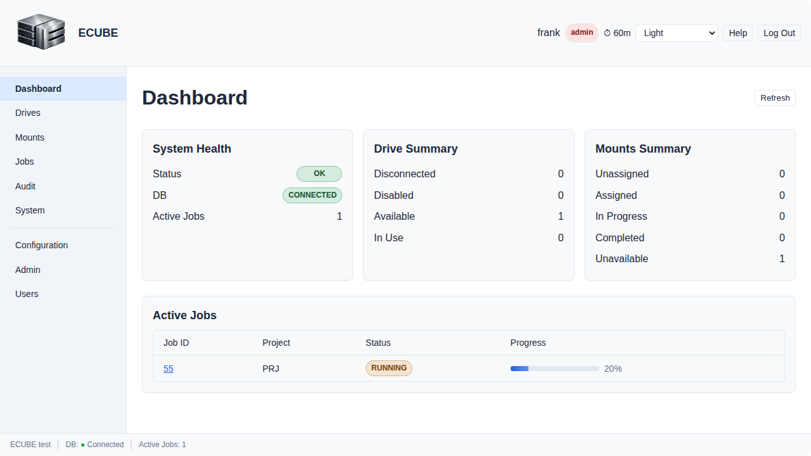

---

## 4. First Access

### 4.1 First-Run Setup Screen

> **Access Summary**
> **Page visibility:** Unauthenticated users are redirected here only when the ECUBE system has not yet been initialized.
> **Intended operator:** Administrator or installer owner responsible for first-run setup.

If the system has not yet been initialized, ECUBE opens the setup wizard instead of the login page. This is typically completed by an administrator.

The setup wizard walks through:

1. Testing database connectivity
2. Provisioning the application database
3. Creating the first administrative account
4. Completing setup and returning to login

If you are not responsible for installation, stop here and contact the administrator who owns the deployment.

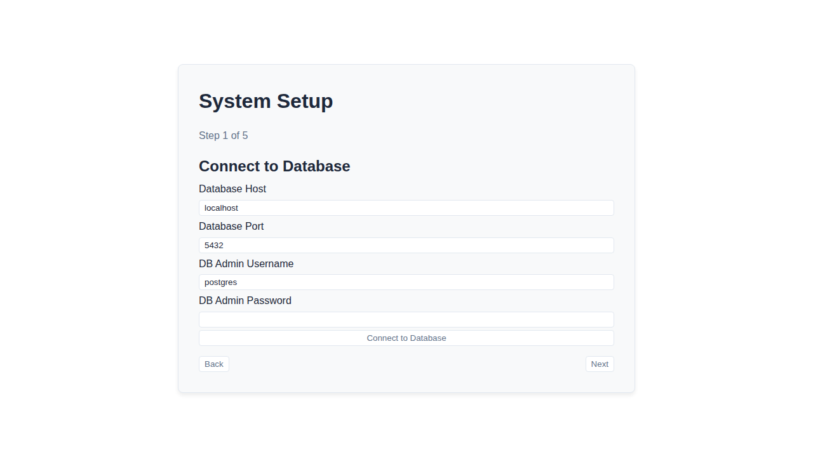

### 4.2 Login

> **Access Summary**
> **Page visibility:** Available to unauthenticated users after setup is complete.
> **Restricted actions:** None.

After setup is complete, open the ECUBE URL and sign in with your assigned username and password.

The login page includes:

- Username field
- Password field
- Login button
- Session-expired banner when you were redirected after token expiry
- Error banner for invalid credentials or connectivity failures

If login fails:

- Re-enter username and password carefully
- Confirm you are using the correct ECUBE URL
- Check whether your browser can reach the site over HTTPS
- Contact an administrator if your account may be locked, missing, or incorrectly assigned

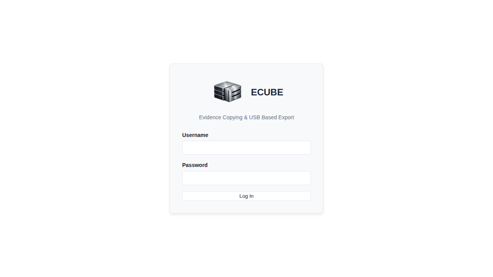

---

## 5. Interface Overview

> **Access Summary**
> **Page visibility:** Available to authenticated users.
> **Restricted actions:** Navigation items shown in the shell depend on the roles assigned to your account.

After login, ECUBE displays a standard application shell:

- Header at the top
- Sidebar navigation on the left
- Main content area in the center
- Footer at the bottom

Common navigation items include:

- `Dashboard`
- `Drives`
- `Mounts`
- `Jobs`
- `Audit` (role-restricted)
- `System`
- `Users` (admin-only or otherwise restricted)
- `Configuration` (admin-only)

If you do not see a page described in this manual, your role may not include access to it.

### 5.1 Theme Selection (Light/Dark/Custom)

> **Access Summary**
> **Page visibility:** Available to authenticated users.
> **Restricted actions:** None. Theme selection is user-level and does not require an elevated role.

To change your theme in the current session:

1. Open the theme selector in the top-right header area.
2. Choose the desired theme (for example `Light` or `Dark`).
3. Confirm visual changes are applied immediately.

How theme preference is stored:

- Theme choice is saved in browser local storage for that browser profile.
- Different browsers or machines may show different themes for the same user account.

Important default-theme note:

- The web UI currently does not provide an administrator control to set a system-wide default theme for all users.
- Platform administrators can still influence the deployment default by controlling which CSS is served as `default.css` in the mounted themes directory.

For deployment-side theme and branding management, see [14-theme-and-branding-guide.md](14-theme-and-branding-guide.md) and [04-configuration-reference.md](04-configuration-reference.md) (`ECUBE_THEMES_DIR`).

---

## 6. Dashboard

> **Access Summary**
> **Page visibility:** `admin`, `manager`, `processor`, `auditor`
> **Restricted actions:** None described on this screen; use linked pages for operational actions.

The dashboard provides a quick operational summary.

Typical information shown:

- Overall system health
- Database status
- Number of active jobs
- Drive state summary (`EMPTY`, `AVAILABLE`, `IN_USE`)
- Table of active jobs

Use the dashboard when you need a quick answer to questions such as:

- Is the system healthy?
- Are any jobs currently running or verifying?
- How many drives are ready for use?

The dashboard is intended for situational awareness, not full task execution. Use the dedicated pages for detailed operations.

---

## 7. Drives

> **Access Summary**
> **Page visibility:** `admin`, `manager`, `processor`, `auditor`
> **Restricted actions:** Drive detail actions such as format, initialize, and prepare eject are currently enabled only for `admin` and `manager`.

The `Drives` page shows detected USB drives and their current state.

Typical drive fields include:

- Device identifier
- Filesystem type
- Capacity
- Assigned project
- Current state

Available actions depend on your role and the selected drive.

### 7.1 Viewing Drives

Use the page controls to:

- Refresh the current drive list
- Trigger a rescan of connected drives
- Search by device or project information
- Filter by drive state
- Sort results

### 7.2 Drive Detail Page

Selecting a drive opens a detail view showing:

- Drive identifiers and filesystem details
- Current project assignment
- Current status badge
- Available actions such as format, initialize, and prepare eject

### 7.3 Formatting a Drive

If your role allows it, you can format a drive from the detail page.

Current UI options include:

- `ext4`
- `exfat`

Formatting removes existing data. Confirm the target drive carefully before proceeding.

### 7.4 Initializing a Drive

Initialization associates a drive with a project identifier. After a drive is initialized, project isolation rules apply to writes performed through ECUBE.

Before initializing a drive:

- Confirm the project identifier is correct
- Confirm the drive is the intended destination media

### 7.5 Prepare Eject

Use `Prepare Eject` before physically removing a drive. This allows the system to complete pending operations and safely transition the device for removal.

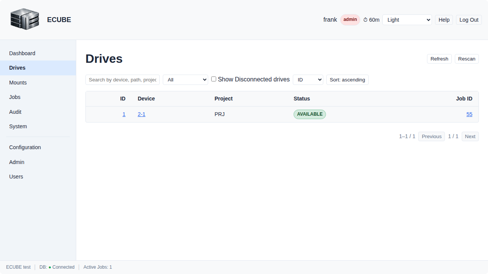

---

## 8. Mounts

> **Access Summary**
> **Page visibility:** `admin`, `manager`, `processor`, `auditor`
> **Restricted actions:** The mounts page is currently available to all authenticated users in the frontend.

The `Mounts` page manages source locations used for export jobs.

You can typically:

- Refresh the mount list
- Validate all mounts
- Validate an individual mount
- Add a new mount definition
- Remove an existing mount definition

### 8.1 Adding a Mount

The add-mount dialog supports common fields such as:

- Type (`SMB` or `NFS`)
- Remote path
- Local mount point
- Username
- Password
- Credentials file

The exact fields required depend on the mount type and your environment.

### 8.2 Testing Mount Connectivity

Use `Test` or `Test All` to verify that configured source mounts are reachable and valid before creating jobs that depend on them.

### 8.3 Removing a Mount

Remove a mount only if it is no longer needed. If existing workflows depend on it, removing the definition can interrupt job creation or repeatability.

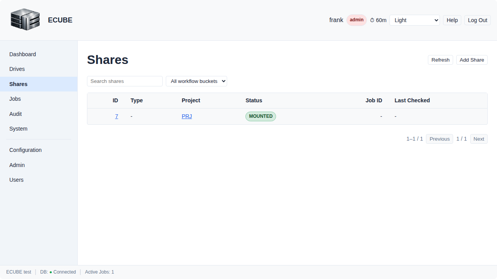

---

## 9. Jobs

> **Access Summary**
> **Page visibility:** `admin`, `manager`, `processor`, `auditor`
> **Restricted actions:** Creating jobs in the current UI is enabled for `admin`, `manager`, and `processor`.

The `Jobs` page is the main workspace for creating and tracking export operations.

The page includes:

- A jobs table
- Search and status filters
- Refresh action
- `Create Job` wizard

### 9.1 Viewing Jobs

Use the jobs table to review:

- Job ID
- Project ID
- Evidence number
- Current status
- Progress percentage

Common statuses include:

- `PENDING`
- `RUNNING`
- `VERIFYING`
- `COMPLETED`
- `FAILED`

### 9.2 Creating a Job

The job wizard is a four-step flow:

1. Select a target drive
2. Select a source mount
3. Enter project, evidence number, and source path
4. Choose thread count and create the job

Before creating a job, confirm:

- The correct destination drive is selected
- The correct source mount is selected
- The project ID matches the evidence being exported
- The source path is correct relative to the selected mount

### 9.3 Opening a Job

Open a job to view details and perform follow-up actions.

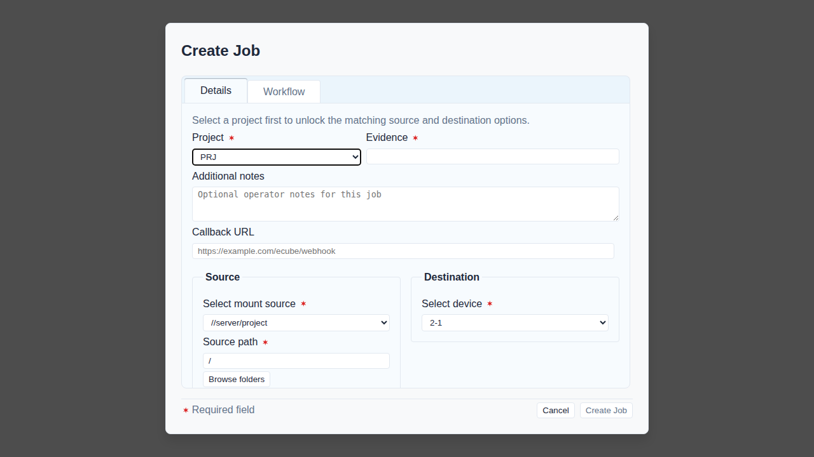

---

## 10. Job Detail, Verification, and File Review

> **Access Summary**
> **Page visibility:** `admin`, `manager`, `processor`, `auditor`
> **Restricted actions:** `Start`, `Verify`, and `Manifest` actions are enabled for `admin`, `manager`, and `processor`. Hash inspection and debug-oriented file views are enabled for `admin` and `auditor`.

The job detail page provides deeper inspection and follow-up controls.

Typical functions include:

- Start a pending job
- Trigger verification
- Generate a manifest
- Review copied files
- Inspect hashes for individual files
- Compare two files

### 10.1 Starting, Verifying, and Generating a Manifest

Action buttons are shown near the top of the job detail screen.

Use them when appropriate:

- `Start` to begin the job
- `Verify` to run verification checks
- `Manifest` to generate the manifest output

### 10.2 File List

The file table usually shows:

- Relative path
- Status
- Size
- Checksum information

### 10.3 Hash Viewer

Users with sufficient permissions can inspect file hashes, including values such as:

- MD5
- SHA-256

### 10.4 Compare Two Files

The compare panel lets you select two files and evaluate whether they match.

Comparison output can include:

- Overall match
- Hash match
- Size match
- Path match

This is useful when reviewing evidence consistency or confirming repeatability after copy or verification steps.

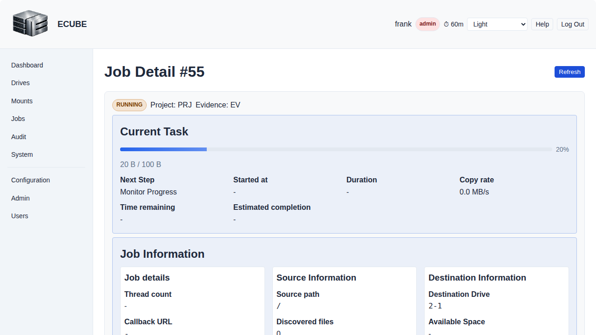

---

## 11. Audit Logs

> **Access Summary**
> **Page visibility:** `admin`, `manager`, `auditor`
> **Restricted actions:** CSV export is available from the page for authorized users.

The `Audit` page is available only to authorized roles.

Use it to:

- Refresh recent audit activity
- Filter by user
- Filter by action
- Filter by date/time range
- Expand structured details for individual records
- Export the result set as CSV

The audit page is useful for review, compliance, and incident follow-up.

When exporting CSV:

- Review filters before export so the file contains the intended data set
- Treat exported audit data as sensitive operational evidence

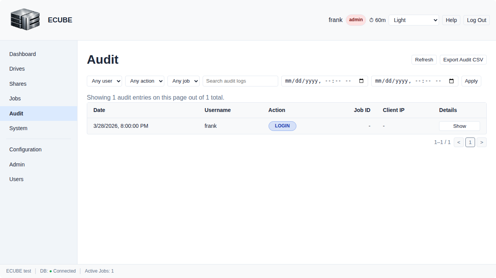

---

## 12. Users

> **Access Summary**
> **Page visibility:** `admin`
> **Restricted actions:** All user-management actions on this page are administrator-only.

The `Users` page is role-restricted and is generally intended for administrators.

Functions available from this page can include:

- Refreshing the current user list
- Creating an operating-system user for ECUBE access
- Assigning or removing ECUBE roles
- Resetting a user's password

### 12.1 Reset a User Password

**Allowed roles:** `admin`

1. Open `Users`.
2. Locate the target account in the users table.
3. Open the password reset action for that user.
4. Enter a temporary or policy-compliant new password.
5. Confirm the reset action.
6. Verify the UI shows a success confirmation.
7. Communicate the temporary password through your approved secure channel.
8. Require the user to change it at first sign-in if required by your policy.

Notes:

- Reset only ECUBE-managed accounts from this workflow.
- Use strong passwords that meet your organization security requirements.
- Record administrative password-reset actions according to your SOP.

If your role does not include access to this page, the navigation item will not appear.

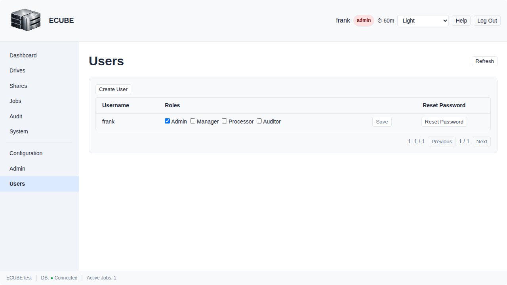

### 12.2 Configuration Page (Administrator)

**Allowed roles:** `admin`

Use the `Configuration` page to update selected runtime settings from the UI without logging into the host terminal.

What this page is for:

- Adjusting logging behavior (level, format, and file logging options)
- Adjusting selected database pool settings exposed by the UI
- Applying safe configuration changes through role-restricted workflows

Basic workflow:

1. Open `Configuration` from the admin navigation area.
2. Review current values in each section.
3. Edit one or more fields.
4. Click `Save`.
5. Review post-save status: some changes apply immediately, and some changes are marked as pending restart.

Restart-required workflow:

1. If the page indicates that restart is required, review the listed changed settings.
2. Click `Restart Service` only when you are ready.
3. Read the confirmation dialog.
4. Confirm restart to submit the service restart request.
5. If you select cancel, no restart is triggered and the service keeps running.

Important operational notes:

- Restart actions are never automatic from this page and always require explicit confirmation.
- Restarting the application service can interrupt active operations. Prefer using a maintenance window or an idle period.
- If restart submission fails, use the displayed error and contact platform support or perform restart through approved host-level procedures.
- For field-by-field meaning and defaults, see [04-configuration-reference.md](04-configuration-reference.md).

If your role does not include access to this page, the navigation item will not appear.

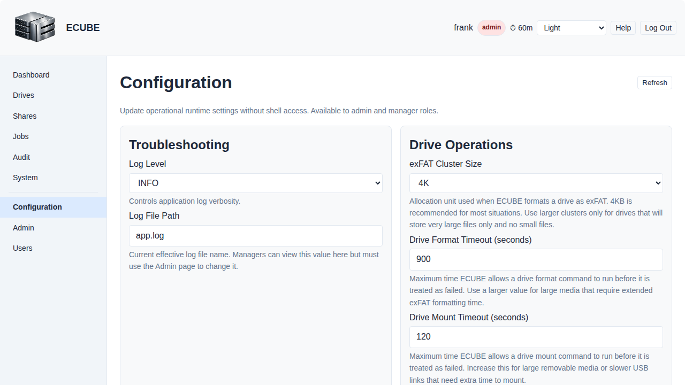

---

## 13. System

> **Access Summary**
> **Page visibility:** `admin`, `manager`, `processor`, `auditor`
> **Restricted actions:** Most diagnostics on this page are relevant to administrators and support personnel. Log viewing is admin-only.

The `System` page provides operational and diagnostic information. Depending on deployment and permissions, this may include system health, USB information, block-device data, mount diagnostics, application logs, and job-debug details.

This page is useful when:

- Confirming the backend is healthy
- Checking whether hardware is visible to ECUBE
- Reviewing mount or log details during issue investigation
- Investigating system errors or performance issues via application logs (admin-only)

End users who only perform evidence exports may rarely need this page. Administrators and support personnel are more likely to use it during troubleshooting.

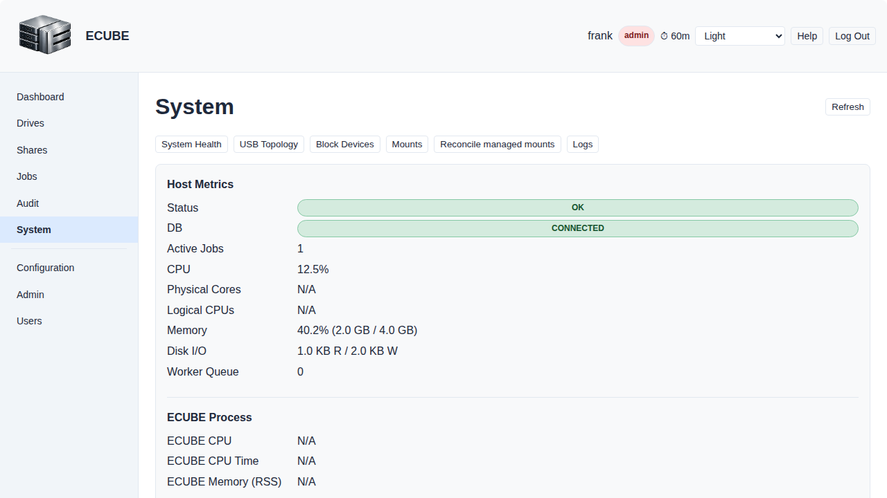

### 13.1 Application Logs Tab

**Access:** `admin` role only

The **Logs** tab allows administrators to view recent application log lines in real time without requiring SSH or command-line access to the ECUBE host. This is useful for diagnosing system issues, checking for errors, and monitoring application behavior.

#### Viewing Logs

1. Open the `System` page.
2. Click the **Logs** tab (visible to admins only).
3. The tab displays recent log lines from the application log file.
4. Log entries are displayed in reverse chronological order (newest first).
5. File metadata shows:
	- **Source:** Log source display path (basename only, for example `app.log`)
	- **Fetched at:** Viewer-local date/time (converted by the browser from the UTC timestamp returned by the API)
	- **File modified:** Last modification time of the log file

#### Searching Logs

1. Enter a search term in the **Search** field.
2. Only log lines containing your search term will be displayed.
3. The search is case-insensitive.
4. Click **Refresh** to rerun the search with fresh log data.

#### Pagination

1. The current Logs tab UI does not expose **Limit** or **Offset** controls.
2. Log results are fetched using the UI's built-in defaults and refreshed with the **Refresh** action.
3. A total-count indicator (for example, "X of Y lines") is not currently shown in the UI.

#### Automatic Redaction

All sensitive values are automatically redacted from displayed log lines:

- **Passwords and tokens:** Any field containing password, secret, api_key, or token values are masked (e.g., `password=***`)
- **Authorization headers:** Bearer tokens in Authorization headers are sanitized
- **Credential-like values:** Other sensitive patterns (e.g., sensitive JSON fields) are masked

This redaction occurs automatically; you cannot bypass it via search or filter options.

#### Refreshing Log Data

1. Click the **Refresh** button to retrieve the latest log entries.
2. The displayed lines update immediately with the most recent data from the log file.
3. If the log file has been rotated or is unavailable, an appropriate error message appears.

#### Troubleshooting Log Viewing

If the Logs tab shows an error or is unavailable:

- Verify you have the `admin` role (non-admin users will not see this tab).
- Check that the application log file exists on the ECUBE host.
- Verify the ECUBE service account has read permissions on the log file.
- Consult [15. Troubleshooting](#15-troubleshooting) for service-level issues.

Governance note: denied log access attempts by non-admin users are recorded in the audit trail for accountability and compliance visibility.

---

## 14. Common Tasks

### 14.1 Insert a New Drive and Associate It with a Project

**Allowed roles:** `admin`, `manager`

1. Insert the new USB drive into the ECUBE host.
2. Open `Drives`.
3. Refresh or rescan the drive list until the new device appears.
4. Open the drive detail page.
5. If required, format the drive using the intended filesystem.
6. Initialize the drive with the correct project identifier.
7. Confirm the drive now shows the expected project association and state.

Notes:

- `processor` and `auditor` users can view drives but cannot perform format or initialize actions in the current UI.
- Confirm the project identifier carefully before initialization because project isolation is enforced after association.

### 14.2 Prepare a Drive for Removal and Shipment

**Allowed roles:** `admin`, `manager`

1. Confirm the export job is complete and any required verification or manifest generation has finished.
2. Open `Drives` and select the target drive.
3. Review the drive details to confirm you have the correct media.
4. Click `Prepare Eject`.
5. Wait for the UI to indicate success.
6. Physically remove the drive only after the operation completes.

Notes:

- Use this workflow before final packaging or shipment.
- Do not remove the drive while a copy or verification step is still active.

### 14.3 Export Evidence to a Drive

**Allowed roles:** `admin`, `manager`, `processor`

1. Confirm the correct drive is present and in the expected state.
2. Confirm the source mount is available.
3. Open `Jobs`.
4. Create a new job.
5. Select the drive and mount.
6. Enter project ID, evidence number, and source path.
7. Create the job and open its detail page.
8. Start the job if required.
9. Monitor progress until completion.
10. Run verification and generate a manifest if required by your workflow.

### 14.4 Review Copy Results

**Allowed roles:** `admin`, `manager`, `processor`, `auditor`

1. Open the job detail page.
2. Review the file list and status values.
3. Inspect hashes for specific files if your role allows it.
4. Compare files when you need side-by-side validation.
5. Export or retain the manifest as required by policy.

Notes:

- Hash inspection is currently available to `admin` and `auditor` in the UI.
- Operational actions such as `Start`, `Verify`, and `Manifest` are available to `admin`, `manager`, and `processor`.

### 14.5 Review Audit Activity

**Allowed roles:** `admin`, `manager`, `auditor`

1. Open `Audit`.
2. Apply user, action, and date filters.
3. Expand details for relevant records.
4. Export CSV if you need to retain or share the filtered results.

### 14.6 Add a New User

**Allowed roles:** `admin`

1. Open `Users`.
2. Click `Create User`.
3. Enter the username.
4. Enter a temporary or assigned password.
5. Select the appropriate ECUBE roles.
6. Create the user.
7. Refresh the page and confirm the new user appears with the intended role assignments.

Notes:

- Choose the smallest role set needed for the user's responsibilities.
- If your organization uses a separate account-provisioning process, follow that policy before creating ECUBE access.

### 14.7 Remove a User's ECUBE Access

**Allowed roles:** `admin`

1. Open `Users`.
2. Locate the target user.
3. Clear all assigned ECUBE role checkboxes for that user.
4. Save the role changes.
5. Confirm the user no longer has ECUBE roles assigned.

Notes:

- In the current web UI, removing all roles is the visible workflow for removing ECUBE access.
- Full operating-system user deletion is not currently exposed in the web UI and should be handled through administrative procedures outside this manual.

### 14.8 View Application Logs for Troubleshooting

**Allowed roles:** `admin`

1. Open the `System` page.
2. Click the **Logs** tab (available to admins only).
3. The tab displays the most recent log lines from the application log file.
4. Optionally, enter a search term to filter the displayed lines.
5. Click **Refresh** to load the latest log data.
6. Review the redacted log entries for errors, warnings, or relevant diagnostic messages.
7. If you need to investigate further, take note of timestamps or error messages to share with support, or download the full log file using the file list below the viewer.

Notes:

- Sensitive values (passwords, tokens, API keys) are automatically redacted from displayed logs for security.
- The log viewer shows recent entries only; if you need earlier entries or the full log file, use the file download option in the Logs tab.
- This feature is admin-only to prevent information leakage from diagnostic data.

---

## 15. Troubleshooting

### 15.1 I Cannot Log In

Possible causes:

- Incorrect username or password
- Wrong ECUBE URL
- Browser cannot reach the site
- Your account has not been created or assigned the right role

### 15.2 A Page or Menu Item Is Missing

Possible causes:

- Your role does not include access to that feature
- The system is not fully initialized
- The deployment is using an older or partially upgraded frontend/backend combination

### 15.3 A Button Is Visible but Disabled

Possible causes:

- Your role is read-only for that operation
- The selected object is not in a state that permits the action
- Required data has not been entered yet

### 15.4 The UI Shows a Network Error

Possible causes:

- Backend service unavailable
- Reverse proxy or TLS issue
- Browser blocked cross-origin requests in a nonstandard deployment
- Expired session or lost authentication state

If the problem persists, collect:

- The exact page where the error occurred
- The action you attempted
- The visible error text
- The approximate date and time

Then provide that information to your ECUBE administrator.

### 15.5 USB Drive Is Not Recognized

**Who can do what:**

- End users (`admin`, `manager`, `processor`, `auditor`) can perform UI-level checks.
- Administrators (`admin`) can perform host-level diagnostics and recovery.

If a newly inserted USB drive does not appear in ECUBE, use this sequence.

User-level checks:

1. Re-seat the drive and wait 10-20 seconds.
2. Open `Drives`, then click `Refresh` and `Rescan`.
3. Confirm the drive is connected to the expected copy station and not another host.
4. If available in your role, open `System` and review USB/device information for recent detection changes.
5. If the drive still does not appear, notify an administrator and include:
	Approximate insert time, drive label/vendor/capacity (if known), and USB port or hub location used.

Administrator checks:

1. Verify physical connectivity first:
	Test a known-good port on the same hub and confirm hub power and cable integrity.
2. Verify host-level USB detection:
	`lsusb` and `lsblk`.
3. Check ECUBE service health and recent logs:
	`systemctl status ecube` and `journalctl -u ecube -n 200`.
4. In Docker deployments, verify container USB passthrough configuration matches the deployment design.
5. If the device appears at OS level but not in ECUBE, capture logs and escalate with timestamps and device identifiers.

Common causes:

- Faulty cable, port, or unpowered USB hub
- Unsupported or failing media
- Host permission/device passthrough issues (especially in containerized setups)
- ECUBE service not running or unable to complete hardware discovery

---

## References

- [docs/operations/00-operational-guide.md](00-operational-guide.md)
