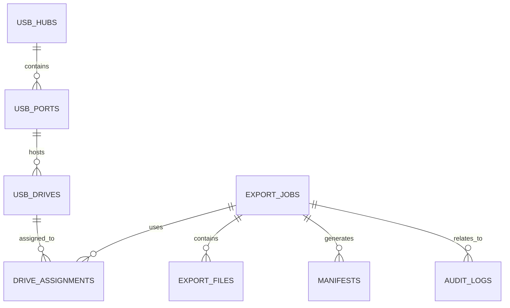
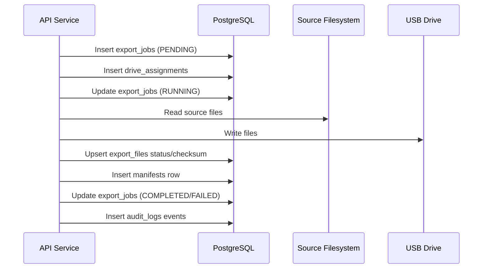
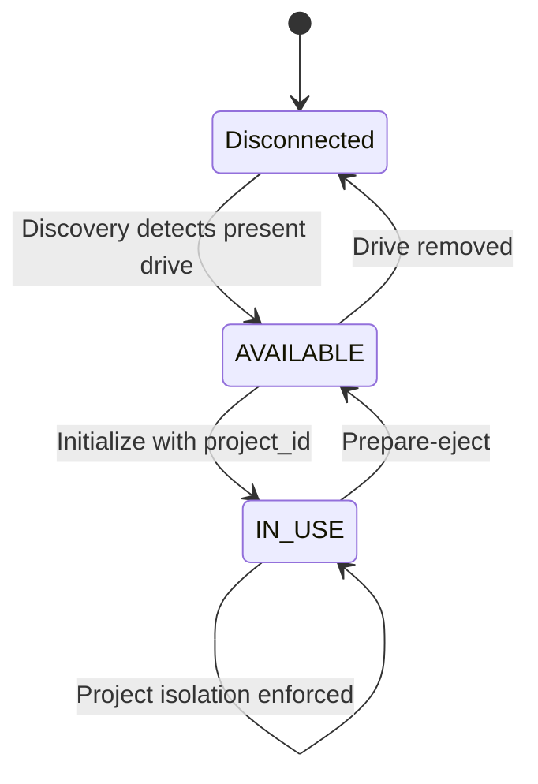
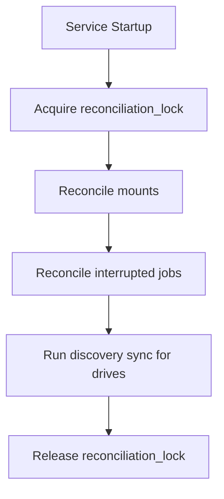

# ECUBE DBA Data Model Reference

| Field | Value |
|---|---|
| Title | DBA Data Model Reference |
| Purpose | Provides database administrators with a reference for ECUBE table structure, column types, relationships, and common query patterns. |
| Updated on | 04/08/26 |
| Audience | Database administrators, SQL support engineers, data governance teams. |

## Table of Contents

1. [Purpose and Scope](#purpose-and-scope)
2. [Conceptual Model](#conceptual-model)
3. [Logical Model](#logical-model)
4. [Physical Model](#physical-model)
5. [Constraints and Integrity Rules](#constraints-and-integrity-rules)
6. [Workflow Visualizations](#workflow-visualizations)
7. [DBML Reference](#dbml-reference)
8. [Rendered Schema Workflow (DBML Import/Export)](#rendered-schema-workflow-dbml-importexport)
9. [Related Documents](#related-documents)

---

## Purpose and Scope

This document is a standalone DBA-focused schema reference for ECUBE and is intentionally separate from operational readiness guidance. It describes the data model in conceptual, logical, and physical forms, includes workflow visualizations, and provides a DBML artifact for rapid schema communication.

## Conceptual Model

At a conceptual level, ECUBE has six domains: Hardware Topology, Mounts, Export Jobs, Audit Trail, Authorization, and System Guards.

- Hardware Topology: hubs, ports, and drives discovered from the host.
- Mounts: NFS/SMB source definitions and mount health state.
- Export Jobs: export job lifecycle, files, manifests, and drive assignments.
- Audit Trail: immutable event records for security and operations.
- Authorization: explicit user-to-role mapping used by API authorization.
- System Guards: single-row tables that serialize initialization and reconciliation.

## Logical Model

The logical model groups tables by business domain and relationship intent.

### Hardware Domain

- `usb_hubs`: stable hub identity and physical location hints.
- `usb_ports`: per-port metadata, enablement state, and admin labels.
- `usb_drives`: runtime drive identity, filesystem classification, and current binding state.

Key relationships:

- `usb_ports.hub_id` -> `usb_hubs.id`
- `usb_drives.port_id` -> `usb_ports.id` (nullable for temporarily unbound topology)

### Mount Domain

- `network_mounts`: external source mount definitions with protocol and health status.

### Job Domain

- `export_jobs`: top-level export lifecycle and throughput metadata.
- `export_files`: per-file copy/verify tracking rows.
- `manifests`: manifest artifacts generated per job.
- `drive_assignments`: assignment history linking drives to jobs.

Key relationships:

- `export_files.job_id` -> `export_jobs.id`
- `manifests.job_id` -> `export_jobs.id`
- `drive_assignments.drive_id` -> `usb_drives.id`
- `drive_assignments.job_id` -> `export_jobs.id`

### Audit Domain

- `audit_logs`: append-only event records; optional job association.

Key relationship:

- `audit_logs.job_id` -> `export_jobs.id` (nullable, `ON DELETE SET NULL`)

### Authorization and System Domain

- `user_roles`: explicit `username` + `role` tuples with uniqueness guarantees.
- `system_initialization`: single-row initialization guard.
- `reconciliation_lock`: single-row startup reconciliation lock.

## Physical Model

This section captures the primary physical schema details used by DBAs.

### Table Inventory

- `usb_hubs`
- `usb_ports`
- `usb_drives`
- `network_mounts`
- `export_jobs`
- `export_files`
- `manifests`
- `drive_assignments`
- `audit_logs`
- `user_roles`
- `system_initialization`
- `reconciliation_lock`

### Core Enumerations

- `drive_state`: `EMPTY` (displayed as "Disconnected"), `AVAILABLE`, `IN_USE`
- `mount_type`: `NFS`, `SMB`
- `mount_status`: `MOUNTED`, `UNMOUNTED`, `ERROR`
- `job_status`: `PENDING`, `RUNNING`, `COMPLETED`, `FAILED`, `VERIFYING`
- `file_status`: `PENDING`, `COPYING`, `DONE`, `ERROR`, `RETRYING`
- `ecube_role`: `admin`, `manager`, `processor`, `auditor`

### Notable Physical Characteristics

- Port and drive identities are unique at the schema level (`usb_ports.system_path`, `usb_drives.device_identifier`).
- `network_mounts.local_mount_point` is unique.
- `user_roles` enforces composite uniqueness on (`username`, `role`).
- Guard tables enforce single-row behavior via check constraints (`id = 1`).
- Audit payloads are stored as JSON (PostgreSQL JSONB variant).

## Constraints and Integrity Rules

- Foreign keys enforce hierarchy and lineage across hardware and job domains.
- Enum-backed status columns constrain legal state values.
- Single-row guard constraints serialize global operations (`initialize`, `reconciliation`).
- Audit rows may exist without job linkage for non-job security or admin events.

## Workflow Visualizations

### Export Job Data Flow

### Drive Lifecycle and Binding

### Startup Reconciliation

## DBML Reference

A concise DBML representation for schema communication and diagram tooling is provided at:

- `docs/database/ecube-schema.dbml`

## Rendered Schema Workflow (DBML Import/Export)

Use this workflow to generate a rendered ER diagram from DBML in one pass.

1. Open the DBML editor at [dbdiagram.io](https://dbdiagram.io/d).
2. Copy the contents of `docs/database/ecube-schema.dbml` and paste them into the editor on the left-hand panel.
3. Confirm relationships and table notes render as expected.
4. Use **Export** to generate PNG or SVG for documentation, or export SQL for review workflows.
5. Save rendered outputs in your preferred docs location (for example, `docs/database/diagrams/`).

Quick access link for convenience:

- [https://dbdiagram.io/d](https://dbdiagram.io/d)

## Related Documents

- [05-data-model.md](../requirements/05-data-model.md)
- [04-functional-requirements.md](../requirements/04-functional-requirements.md)
- [10-security-and-access-control.md](../requirements/10-security-and-access-control.md)
- [10-production-support-procedures.md](10-production-support-procedures.md)

## References

- [docs/requirements/05-data-model.md](../requirements/05-data-model.md)
- [docs/design/05-data-model.md](../design/05-data-model.md)
